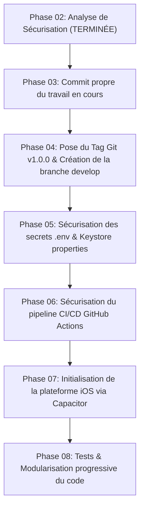

# TABIBI — PHASE 02 — SÉCURISATION AVANT VERSIONING
## RAPPORT D'ANALYSE ET PLAN DE PROTECTION DU PROJET

> **Document de référence technique — Phase 02**  
> **Statut :** ANALYSE DE SÉCURISATION TERMINÉE  
> **Principe appliqué :** Audit passif, aucune action destructive, aucun code modifié, préservation intégrale des modifications locales.  
> **Date de génération :** 12 septembre 2026

---

## A. ÉTAT GIT ACTUEL

### 1. Synthèse des branches et commits
* **Branche courante :** `main`
* **Dépôt distant (Remote) :** `origin` -> `https://github.com/gozimsoft/WebTabibi.git` (fetch & push)
* **Branches existantes (locales et distantes) :**
  * `* main`
  * `remotes/origin/HEAD -> origin/main`
  * `remotes/origin/main`
  * *Observation :* Aucune branche `develop`, `staging` ou `feature` n'existe actuellement. Tout est centralisé sur `main`.
* **État de synchronisation :**
  * La branche locale `main` est **en avance de 3 commits** sur `origin/main` :
    * `7ca15b71` Merge branch 'main' of https://github.com/gozimsoft/WebTabibi
    * `dc35a9e3` fix
    * `aeba3869` fix
* **Tags Git :** Aucun tag n'est présent (`git tag` retourne vide).
* **Fichiers non suivis (Untracked) :**
  * `Docs/TABIBI_PHASE_01_AUDIT_TECHNIQUE.md` (rapport officiel de la Phase 01)

---

## B. MODIFICATIONS LOCALES DÉTECTÉES

Le *working tree* local comporte actuellement **10 fichiers modifiés non commités** représentant **+962 insertions / -70 suppressions**.  
Ces modifications correspondent aux travaux fonctionnels récents et sont **strictement préservées** :

| Fichier | Nature des modifications |
| :--- | :--- |
| `backend/controllers/DoctorController.php` (+151 lignes) | Ajout de la gestion dynamique des motifs de consultation (`reasons`), sélection multiple par médecin, association en BDD. |
| `backend/controllers/ClinicController.php` (+5/-5 lignes) | Harmonisation de l'association médecins-cliniques avec motifs. |
| `backend/index.php` (+13 lignes) | Déclaration des routes API associées aux motifs de consultation (`/api/doctors/reasons`, etc.). |
| `frontend/src/App.jsx` (+542/-1 lignes) | Composants de sélection multiple de motifs pour les médecins et affichage lors de la prise de RDV par les patients. |
| `frontend/src/api/client.js` (+3 lignes) | Méthodes d'appel API pour la récupération et la mise à jour des motifs. |
| `frontend/src/components/SharedUI.jsx` (+72/-69 lignes) | Correction du positionnement et du z-index des notifications Toast (évitant qu'elles ne passent sous le footer). |
| `frontend/src/locales/ar.json` (+56 lignes) | Traductions en arabe des formulaires de contact/tickets et motifs. |
| `frontend/src/locales/en.json` (+56 lignes) | Traductions en anglais des nouveaux intitulés et motifs. |
| `frontend/src/locales/fr.json` (+56 lignes) | Traductions en français des nouveaux intitulés et motifs. |
| `frontend/.env` (+2/-2 lignes) | Configuration de l'URL d'API locale (`VITE_API_URL=http://localhost:8000`). |

> [!IMPORTANT]
> **Règle absolue :** Ces modifications ne doivent sous aucun prétexte faire l'objet d'un `git reset --hard` ou `git checkout --`. Elles constituent du travail actif validé qui devra être commité proprement lors de la transition vers le nouveau modèle de branches.

---

## C. SECRETS DÉTECTÉS

L'inventaire précis des secrets et données sensibles présents dans le projet révèle plusieurs expositions majeures :

### 1. Identifiants de la Base de Données de Production
* **Fichier :** `backend/config/database.php` (lignes 6 à 10)
* **Informations exposées :**
  * `DB_HOST` : `197.140.142.6` (Adresse IP publique du serveur MySQL en production)
  * `DB_PORT` : `3306`
  * `DB_NAME` : `uyyuppcc_DBTabibi`
  * `DB_USER` : `uyyuppcc_admin`
  * `DB_PASS` : `EV]s6^lwR0OnG029` (Mot de passe d'administration direct en clair)

### 2. Identifiants de Messagerie SMTP / Google Mail
* **Fichier :** `backend/config/database.php` (lignes 14 à 16)
* **Informations exposées :**
  * `MAIL_HOST` : `smtp.gmail.com`
  * `MAIL_USER` : `stellarsoftpro@gmail.com`
  * `MAIL_PASS` : `equi uawa usrl wpor` (Mot de passe d'application Google en clair)

### 3. Keystore Android de Signature de Production
* **Fichier physique :** `frontend/tabibi-release.jks` (Taille : 2 739 octets)
* **Fichier de configuration Gradle :** `frontend/android/app/build.gradle` (lignes 21 à 26)
  * `storeFile` : `../../tabibi-release.jks`
  * `storePassword` : `"tabibi2026"` (en clair)
  * `keyAlias` : `"tabibi-key"`
  * `keyPassword` : `"tabibi2026"` (en clair)
* **Fichier texte mémo :** `Compile et signe APK .txt` (contient les mots de passe et la procédure en clair à la racine du projet).

### 4. Variables d'environnement Frontend
* **Fichier :** `frontend/.env`
* **Informations :** URL d'API pointant vers localhost ou production (`VITE_API_URL=https://tabibi.dz` ou `http://localhost:8000`).

---

## D. RISQUES LIÉS AUX SECRETS

### 1. Secrets présents dans les fichiers suivis par Git (Tracked Files)
* `backend/config/database.php` est **suivi par Git** (`tracked`).
* `frontend/tabibi-release.jks` est **suivi par Git** (`tracked`).
* `frontend/android/app/build.gradle` est **suivi par Git** (`tracked`).
* `frontend/.env` est **suivi par Git** (`tracked`).
* `Compile et signe APK .txt` est **suivi par Git** (`tracked`).

### 2. Secrets présents dans l'historique Git et sur GitHub
* Une inspection de l'arbre distant `origin/main` montre que :
  * Le blob du keystore (`dbddc68742b2b96a8c130f3ff408c8c21c8c8bd7`) est **publié sur GitHub**.
  * Le fichier `database.php` avec les identifiants réels est **publié sur GitHub**.
  * Ces fichiers sont présents dans l'historique depuis plusieurs commits (notamment depuis le commit `9efbf800`).
* **Niveau de risque :**
  * Si le dépôt GitHub est privé, le risque immédiat d'intrusion externe est modéré, mais tout collaborateur ou token d'accès a un accès administrateur direct à la base de production.
  * Si le dépôt devenait public, la base de production et le compte Gmail seraient immédiatement compromis.
  * Toute personne possédant le keystore et son mot de passe peut compiler et signer une application malveillante se faisant passer pour l'application officielle Tabibi sur le Google Play Store.

### 3. Stratégie de rotation des secrets
* **Recommandation pour la base de données :** Prévoir à terme un changement du mot de passe de l'utilisateur MySQL de production une fois que les variables d'environnement seront isolées.
* **Recommandation pour le mot de passe Gmail :** Régénérer un mot de passe d'application dans la console Google Workspace / Gmail.
* **Keystore Android :** ⚠️ **NE PAS CHANGER DE CLÉ.** Voir analyse ci-dessous.

---

## E. ANALYSE DU KEYSTORE ANDROID

> [!CAUTION]
> **Avertissement critique :** La signature d'une application Android est irréversible dans l'écosystème Google Play. Si une application a déjà été publiée sur le Play Store avec `tabibi-release.jks` (et sans Google Play App Signing activé), générer un nouveau Keystore rendrait **strictement impossible la mise à jour de l'application pour les utilisateurs existants**.

### Constats techniques :
1. **Emplacement :** `frontend/tabibi-release.jks`.
2. **Utilisation dans Gradle :** Directement lié dans le bloc `signingConfigs.release` de `frontend/android/app/build.gradle`.
3. **Mots de passe :** Présents en dur dans le code source (`tabibi2026`).
4. **Dépendances de build :** Lors de l'exécution de `gradlew assembleRelease` ou `bundleRelease`, Gradle lit directement ces valeurs en dur.

### Plan de sécurisation recommandé (sans changer le keystore) :
1. **Conserver le fichier `tabibi-release.jks` intact.**
2. Créer un fichier local non versionné `frontend/android/keystore.properties` (ou lire des variables d'environnement système).
3. Modifier `build.gradle` pour charger le mot de passe depuis `keystore.properties` ou depuis les variables d'environnement (ex: `System.getenv("KEYSTORE_PASSWORD")`).
4. Ajouter `*.jks`, `*.keystore`, et `keystore.properties` dans le fichier `.gitignore`.
5. Supprimer le fichier d'aide texte `Compile et signe APK .txt` du dépôt Git ou en purger les mots de passe.

---

## F. ANALYSE DU WORKFLOW CI/CD (`.github/workflows/_deploy.yml`)

### Fonctionnement actuel :
```yaml
on:
  push:
    branches:
      - main
```
1. **Déclencheur :** Tout `git push` sur la branche `main` déclenche le déploiement immédiatement.
2. **Méthode :** `SamKirkland/FTP-Deploy-Action@v4.3.4` synchronise l'arborescence locale `./` vers le serveur d'hébergement distant.
3. **Absence de contrôle de qualité :**
   * **Aucun build :** `npm run build` n'est PAS exécuté.
   * **Aucun test :** Aucun test unitaire, d'intégration ou de validation syntaxique.
   * **Aucun linter :** Pas de vérification PHP ni JavaScript.
4. **Risques majeurs identifiés :**
   * **Déploiement accidentel en production :** Dès qu'un développeur pousse sur `main` (ou merge une PR sans faire attention), le code part en production instantanément.
   * **Déploiement de code cassé :** Une simple erreur de syntaxe ou un composant manquant sera immédiatement envoyé en production.
   * **Exposition de fichiers sensibles :** Dans le bloc `exclude:`, les fichiers `.env`, `.git`, et `.github` sont exclus, mais `tabibi-release.jks` et `backend/config/database.php` NE SONT PAS EXCLUS et sont donc synchronisés par FTP !

---

## G. ANALYSE DEV / STAGING / PRODUCTION

Actuellement, le projet ne possède **aucune isolation d'environnement**.

### Besoins pour la future architecture multi-environnements :

| Composant | DEV (Local) | STAGING (Pré-production) | PRODUCTION |
| :--- | :--- | :--- | :--- |
| **Base de Données** | Base locale MySQL (XAMPP `localhost:3306`) ou base cloud dédiée au dev. | Base isolée hébergée avec données de test anonymisées. | Base distante réelle `uyyuppcc_DBTabibi` (`197.140.142.6`). |
| **Backend API URL** | `http://localhost:8000` | `https://staging-api.tabibi.dz` | `https://tabibi.dz` (ou API dédiée). |
| **Frontend Web URL**| `http://localhost:80` / `localhost:5173` | `https://staging.tabibi.dz` | `https://tabibi.dz` |
| **Configuration API**| Fichier `.env.local` côté backend | Fichier `.env` sur le serveur staging | Fichier `.env` sur le serveur prod |
| **Mobile Android** | Build `debug` avec URL de dev ou staging | Build `release-internal` pour test interne | Build `release` signé pour le Play Store |
| **Mobile iOS** | Simulateur / Debug local | TestFlight interne | App Store officiel |

---

## H. RISQUES LIÉS À LA BDD DE PRODUCTION

Le fichier `backend/config/database.php` connecte directement le serveur local (`localhost:8000`) à la base de données distante de production (`197.140.142.6`).

### Dangers immédiats :
1. **Altération ou perte de données réelles :** Lors de tests locaux de création, modification ou suppression (ex: annulation de RDV, modification d'un compte médecin), ce sont les **données des vrais patients et médecins** qui sont altérées.
2. **Rupture de la synchronisation Delphi :** Les cabinets médicaux synchronisent leurs consultations physiques avec cette base via `/api/sync/*`. Tout test local perturbant les tables `apointements` ou `doctorssettingapointements` peut désynchroniser le logiciel des médecins.
3. **Latence réseau :** Chaque requête HTTP locale subit la latence réseau de la connexion distante à la BDD MySQL, faussant les mesures de performance du développement.

---

## I. ACTIONS RECOMMANDÉES

### 1. Sauvegarder les modifications de travail en cours
Faire un commit local propre sur `main` afin de sécuriser les 10 fichiers modifiés récents (gestion des motifs et correctifs de toast).

### 2. Isoler la configuration backend dans un fichier `.env`
* Modifier `backend/config/database.php` pour lire les constantes depuis des variables d'environnement (`getenv()` ou fichier `.env` non versionné) avec des valeurs par défaut pour le local.
* Ajouter `.env` dans `backend/.gitignore`.

### 3. Sécuriser le Keystore Android
* Sortir `tabibi2026` de `frontend/android/app/build.gradle`.
* Charger les mots de passe via `keystore.properties` (exclu de Git).
* Conserver précieusement le fichier `tabibi-release.jks`.

### 4. Sécuriser le pipeline GitHub Actions
* Modifier le déclencheur pour que le déploiement automatique ne se fasse plus sur de simples pushs imprévus.
* Mettre en place une branche `develop` pour le développement quotidien.
* La branche `main` ne doit recevoir que des releases stables et validées.

---

## J. ACTIONS QUI NÉCESSITENT VOTRE AUTORISATION EXPLICITE

Avant d'exécuter l'une de ces actions lors des phases suivantes, votre validation formelle sera demandée :

1. **Commit des 10 fichiers de travail locaux :** Enregistrement des modifications en cours dans l'historique Git.
2. **Création de la branche `develop` :** Découplage du flux de travail quotidien de la branche `main` de production.
3. **Création du tag initial `v1.0.0` :** Figeage de la version actuelle.
4. **Extraction des secrets de `database.php` vers un `.env` backend :** Pour basculer le développement local sur une base de données de test sans toucher à la production.
5. **Modification du workflow CI/CD `.github/workflows/_deploy.yml` :** Pour désactiver le déploiement FTP aveugle sur chaque push.
6. **Mise à jour du `.gitignore` :** Pour ignorer le keystore et les fichiers `.env`.

---

## K. ORDRE RECOMMANDÉ DES PROCHAINES OPÉRATIONS (ROADMAP)

Pour avancer sans le moindre risque de régression :



1. **Étape 1 :** Commit officiel des modifications fonctionnelles en cours sur `main`.
2. **Étape 2 :** Pose du tag Git `v1.0.0` marquant l'état stable de départ.
3. **Étape 3 :** Création et basculement sur la branche `develop`.
4. **Étape 4 :** Externalisation des secrets (`.env` pour le backend, `keystore.properties` pour Android).
5. **Étape 5 :** Sécurisation du workflow GitHub Actions (ajout d'une étape de build et ciblage sélectif).
6. **Étape 6 :** Préparation de l'environnement iOS (`@capacitor/ios` et configuration du projet Xcode).

---
*Ce rapport constitue la base technique officielle de la Phase 02. Aucune modification de code ni action destructive n'a été effectuée. En attente de vos instructions pour la Phase suivante.*
