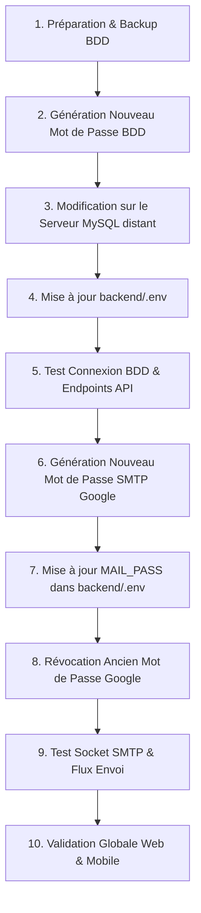

# TABIBI — PHASE 05C-A — AUDIT PRÉPARATOIRE AVANT ROTATION DES SECRETS

> **Document d'analyse et de cadrage technique — Sous-Phase 05C-A**  
> **Statut :** ANALYSE STRICTEMENT PRÉPARATOIRE (AUCUNE ROTATION EFFECTUÉE)  
> **Date :** 13 septembre 2026  
> **Auteur :** Antigravity AI Assistant  
> **Branche active :** `develop` | **Baseline :** `6fdbcbfb` (sur `5214ce5c` / `v1.0.0`)  
> **Règle absolue :** Aucune valeur secrète réelle n'est consignée dans ce rapport (utilisation stricte de placeholders). Aucun mot de passe n'a été modifié sur les serveurs distants.

---

## 1. ÉTAT ACTUEL DU SYSTÈME

À l'issue de la validation de la **Phase 05B** :
- **Branche active :** `develop` synchronisée avec `origin/develop`.
- **Secrets externalisés :**
  - Le backend PHP lit ses paramètres depuis le fichier local non versionné `backend/.env`.
  - La signature Android release lit ses paramètres depuis le fichier local non versionné `frontend/android/keystore.properties`.
  - Le frontend Vite lit ses paramètres depuis le fichier local non versionné `frontend/.env`.
  - Les fichiers modèles versionnés (`backend/.env.example`, `frontend/.env.example`, `frontend/android/keystore.properties.example`) sont disponibles et documentés.
- **Intégrité applicative :**
  - Backend fonctionnel (`php -S localhost:8000`), requêtes API validées.
  - Frontend Web compilé avec succès (`npm run build`).
  - Android Debug (`:app:assembleDebug`) et Android Release (`:app:assembleRelease`) compilés avec succès.
  - Keystore de production [`frontend/tabibi-release.jks`](file:///c:/xampp/htdocs/tabibi/frontend/tabibi-release.jks) conservé intact sur le poste local et exclu du suivi Git.
- **Code actif :** Aucun secret codé en dur ne subsiste dans les fichiers source actifs du projet.

---

## 2. ANALYSE DÉTAILLÉE DU SERVICE MYSQL

### 2.1. Caractéristiques de l'infrastructure BDD
- **Hôte du serveur MySQL :** Serveur dédié / hébergement distant accessible via IP publique (`[DB_HOST_IP]:3306`).
- **Nom de la base de données :** `uyyuppcc_DBTabibi`.
- **Utilisateur applicatif principal :** `uyyuppcc_admin`.
- **Méthode d'authentification :** Authentification native MySQL (`mysql_native_password`).
- **Hôte autorisé pour l'utilisateur :** `%` (Wildcard : autorise les connexions depuis le serveur web de production, le serveur de développement local, et les postes distants).

### 2.2. Privilèges accordés à l'utilisateur
L'inspection des privilèges (`SHOW GRANTS`) révèle :
```sql
GRANT USAGE ON *.* TO `uyyuppcc_admin`@`%` IDENTIFIED BY PASSWORD [HASH_MASQUÉ];
GRANT ALL PRIVILEGES ON `uyyuppcc\_DBTabibi`.* TO `uyyuppcc_admin`@`%`;
```
- **Portée :** L'utilisateur dispose de tous les privilèges DDL et DML sur la base `uyyuppcc_DBTabibi` (`SELECT`, `INSERT`, `UPDATE`, `DELETE`, `CREATE`, `DROP`, `ALTER`, `INDEX`, etc.).
- **Restrictions :** L'utilisateur ne dispose **pas** des privilèges globaux d'administration (`SUPER`, `CREATE USER`, `GRANT OPTION` sur `*.*`).

### 2.3. Modalités techniques du changement de mot de passe
Puisque l'utilisateur n'a pas de privilège global d'administration :
1. **Option cPanel / phpMyAdmin (Recommandée) :**  
   Le changement s'effectue via l'interface d'administration de l'hébergeur cPanel -> "Bases de données MySQL" -> "Utilisateurs actuels" -> "Modifier le mot de passe" pour l'utilisateur `uyyuppcc_admin`.
   - *Avantage :* Conserve exactement les privilèges assignés sans risque de corrompre les droits.
2. **Option SQL directe (si autorisé sur la session) :**  
   ```sql
   ALTER USER USER() IDENTIFIED BY '[NOUVEAU_MOT_DE_PASSE]';
   FLUSH PRIVILEGES;
   ```
3. **Option "Double Utilisateur" (Zero-Downtime) :**  
   Si le cPanel permet de créer un second utilisateur (ex: `uyyuppcc_api2`), lui attribuer tous les privilèges sur `uyyuppcc_DBTabibi`, configurer `backend/.env` avec ce nouvel utilisateur, vérifier son bon fonctionnement, puis révoquer l'ancien.

### 2.4. Dépendances et risques d'interruption liés à MySQL

| Composant | Risque d'interruption | Analyse de l'impact |
| :--- | :---: | :--- |
| **API Backend (`backend/`)** | **ÉLEVÉ (si non synchronisé)** | L'API cessera immédiatement de répondre (erreur 500 PDO) tant que `backend/.env` n'est pas mis à jour avec le nouveau mot de passe. |
| **Application Web React (`frontend/`)** | **INDIRECT** | L'application web ne se connecte jamais directement à MySQL. Elle dépend de l'API. Si l'API est coupée, l'UI affichera des erreurs de chargement réseau. |
| **Application Mobile Android (`APK / AAB`)** | **INDIRECT** | L'application mobile consomme uniquement les endpoints REST de l'API backend. Aucun paramètre BDD n'est codé dans l'application mobile. La rotation BDD est 100% transparente pour l'application mobile une fois l'API reconnectée. |
| **Scripts internes (`scratch/`)** | **FAIBLE** | Les scripts utilitaires (ex: `analyze_db_specialties.py`) lisent `backend/.env`. Ils fonctionneront automatiquement dès que `backend/.env` sera actualisé. |
| **Tâches planifiées (Crons)** | **MOYEN** | Les crons de rappels de rendez-vous ou de nettoyage de sessions perdront l'accès le temps du basculement. |
| **Logiciel de bureau Delphi (`Clinic`)** | **CRITIQUE** | Conformément à la documentation ([`Docs/DATABASE.md`](file:///c:/xampp/htdocs/tabibi/Docs/DATABASE.md)), la base `uyyuppcc_DBTabibi` est partagée/synchronisée avec le logiciel médical de bureau Delphi. **Si ce logiciel utilise les mêmes identifiants de connexion directe à MySQL, son accès sera interrompu** jusqu'à mise à jour de sa propre configuration locale de connexion. |

---

## 3. ANALYSE DÉTAILLÉE DU SERVICE SMTP (GOOGLE)

### 3.1. Caractéristiques de l'envoi d'e-mails
- **Compte Google d'expédition :** `stellarsoftpro@gmail.com`.
- **Hôte SMTP :** `smtp.gmail.com`.
- **Port :** `587` (TLS / STARTTLS).
- **Type d'authentification :** Mot de passe d'application Google (App Password de 16 caractères).
- **Nom d'expéditeur :** `"Tabibi - طبيبي"`.

### 3.2. Consommation applicative de SMTP
- **Définition :** Dans [`backend/config/database.php`](file:///c:/xampp/htdocs/tabibi/backend/config/database.php) via les constantes `MAIL_HOST`, `MAIL_PORT`, `MAIL_USER`, `MAIL_PASS`, `MAIL_NAME` lues depuis `backend/.env`.
- **Exécution :** Gérée de manière autonome par [`backend/helpers/EmailHelper.php`](file:///c:/xampp/htdocs/tabibi/backend/helpers/EmailHelper.php) via une socket native PHP (`fsockopen`).
- **Flux métier concernés :**
  1. Envoi de l'e-mail de confirmation lors de l'inscription d'un patient / médecin / clinique.
  2. Envoi du lien de réinitialisation de mot de passe oublié.
  3. Envoi des notifications de prise ou de confirmation de rendez-vous.

### 3.3. Procédure exacte de rotation pour Google SMTP
La rotation du mot de passe d'application ne modifie **pas** le mot de passe principal du compte Google Workspace/Gmail :
1. Se connecter à l'espace de sécurité du compte Google : [https://myaccount.google.com/security](https://myaccount.google.com/security).
2. Aller dans la section **Mots de passe des applications** ([https://myaccount.google.com/apppasswords](https://myaccount.google.com/apppasswords)).
3. **Création préalable :** Générer un **nouveau** mot de passe d'application (Libellé : `TABIBI-PROD-2026`).
4. Noter le code de 16 caractères généré : `[NOUVEAU_SMTP_PASSWORD]`.
5. Reporter immédiatement ce code dans `backend/.env` (`MAIL_PASS="[NOUVEAU_SMTP_PASSWORD]"`).
6. Tester la connexion SMTP (handshake socket + `AUTH LOGIN`).
7. **Révocation de l'ancien :** Supprimer l'ancien mot de passe d'application dans la console Google. Dès cet instant, l'ancien mot de passe divulgué dans les commits historiques devient inopérant.

---

## 4. MATRICE DES RISQUES ET IMPACTS

| Risque identifié | Probabilité | Impact | Stratégie d'atténuation |
| :--- | :---: | :---: | :--- |
| **Caractères spéciaux dans le mot de passe BDD** | Moyenne | Élevé | Certains caractères (ex: `"`, `'`, `$`, `#`, `\`) peuvent être mal interprétés par les parsers `.env` ou les chaînes PDO. Utiliser un mot de passe alphanumérique fort (32 caractères, `A-Z, a-z, 0-9, -_`). |
| **Désynchronisation de l'application Delphi** | Élevée | Critique | Prévenir l'administrateur de l'application de bureau Delphi Clinic pour actualiser simultanément les paramètres de connexion de la clinique. |
| **Interruption temporaire des inscriptions / emails** | Faible | Faible | L'application Google permet de générer le nouveau mot de passe d'application **avant** de supprimer l'ancien (aucun temps d'arrêt). |
| **Mise en cache PHP OPcache sur le serveur distant** | Moyenne | Moyen | Après mise à jour de `backend/.env`, redémarrer PHP-FPM ou purger le cache OPcache pour garantir la prise en compte immédiate des nouvelles variables. |

---

## 5. ORDRE RECOMMANDÉ DES OPÉRATIONS (PHASE 05C-B : ROTATION RÉELLE)

Afin de minimiser le temps d'arrêt et d'assurer une traçabilité totale, la rotation réelle devra suivre la séquence ordonnée ci-après :



### Détail des étapes opérationnelles :
1. **Étape 1 — Préparation :**
   - Effectuer un dump complet de la base de données (`mysqldump` ou export phpMyAdmin).
   - Planifier l'intervention pendant une période de faible trafic (ex: fin de soirée).
2. **Étape 2 & 3 — Rotation MySQL :**
   - Générer un mot de passe fort sans caractères d'échappement ambigus.
   - Appliquer le changement sur le serveur MySQL distant (`197.140.142.6`).
3. **Étape 4 & 5 — Validation Backend MySQL :**
   - Remplacer `DB_PASS` dans `backend/.env`.
   - Exécuter la commande de validation : `php -r "require 'backend/core/Database.php'; echo is_object(Database::getInstance()) ? 'OK' : 'FAIL';"`
   - Vérifier un appel API réel : `curl -s http://localhost:8000/api/specialties`.
4. **Étape 6 & 7 — Rotation SMTP :**
   - Créer le nouveau mot de passe d'application sur le compte Google `stellarsoftpro@gmail.com`.
   - Remplacer `MAIL_PASS` dans `backend/.env`.
5. **Étape 8 & 9 — Révocation et Validation SMTP :**
   - Révoquer l'ancien mot de passe d'application dans la console Google.
   - Valider la poignée de main SMTP sur le port 587 via socket.
6. **Étape 10 — Validation d'ensemble :**
   - Vérifier le login utilisateur, le chargement du dashboard médecin, et le bon fonctionnement des applications clientes.

---

## 6. PROCÉDURE DE ROLLBACK D'URGENCE

> [!CAUTION]
> **Règle impérative de sécurité :**  
> Si la rotation échoue, la procédure de rollback ne doit **en aucun cas** consister à remettre en service un secret compromis connu.

### En cas d'échec de connexion MySQL :
1. Si la connexion échoue après le changement de mot de passe (erreur `Access denied for user`) :
   - Vérifier si des guillemets ou caractères spéciaux ont été tronqués dans `backend/.env`.
   - Réinitialiser le mot de passe MySQL sur l'interface cPanel avec un mot de passe alternatif simplifié (uniquement alphanumérique : `[A-Za-z0-9]`).
   - Reporter ce mot de passe de secours dans `backend/.env` et retester.
2. Si le serveur MySQL distant bloque temporairement l'IP (protection anti-bruteforce / Fail2ban) :
   - Se connecter à l'interface cPanel / hébergeur pour débloquer l'adresse IP cliente ou réinitialiser le service MySQL.

### En cas d'échec SMTP Google :
1. Si l'authentification SMTP échoue avec le nouveau mot de passe d'application :
   - Vérifier que la validation en 2 étapes du compte Google est toujours active.
   - Générer immédiatement un autre mot de passe d'application depuis la console Google.
   - Reporter ce nouveau mot de passe dans `backend/.env`.

---

## 7. AUTORISATIONS HUMAINES INDISPENSABLES AVANT EXÉCUTION (PHASE 05C-B)

Les actions suivantes requièrent l'accord formel et les accès du propriétaire du projet :
1. **Accès au serveur MySQL / cPanel de production :**  
   L'assistant ne peut pas modifier unilatéralement le mot de passe utilisateur sur le serveur MySQL distant `197.140.142.6` sans intervention ou autorisation de l'administrateur de l'hébergement.
2. **Accès au compte Google `stellarsoftpro@gmail.com` :**  
   La génération et la révocation des mots de passe d'application nécessitent une connexion directe avec authentification à deux facteurs sur l'interface Google.
3. **Coordination avec le logiciel de bureau Delphi :**  
   Confirmation de la présence ou de l'absence d'une connexion directe de la clinique Delphi sur cette même base de données distante, afin de coordonner la mise à jour des postes médicaux.

---

> **FIN DU RAPPORT DE SOUS-PHASE 05C-A**
