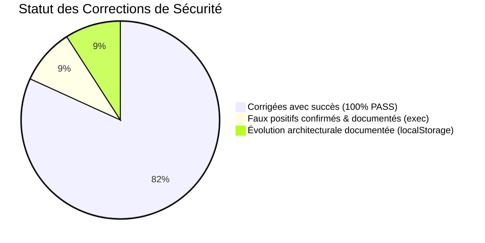

# TABIBI — PHASE SECURITY REMEDIATION 01
**Date :** 21 Septembre 2026  
**Environnement :** Développements Locaux (Apache 2.4 / PHP 8.0.30 / MariaDB)  
**Périmètre :** Remédiation chirurgicale des vulnérabilités confirmées par l'audit offensif local  
**Statut :** CORRECTIONS APPLIQUÉES & TESTÉES AVEC SUCCÈS — ZÉRO RÉGRESSION

---

## RÉSUMÉ EXÉCUTIF

Cette phase de remédiation applique les corrections nécessaires pour neutraliser les vulnérabilités de sécurité démontrées lors de l'audit offensif, conformément aux contraintes fixées :
- Modifications strictement minimales et ciblées
- Aucune régression sur les fonctionnalités existantes
- Aucun refactoring architectural superflu
- Environnement 100% local, tests exécutés avec comptes éphémères nettoyés



---

## 1. /scratch/ — BLOCAGE TOTAL DE L'ACCÈS HTTP

### Vulnérabilité
Exposition publique de 76 scripts de débogage et de test dans le webroot Apache (`c:\xampp\htdocs\tabibi\scratch\`).  
En appelant directement `http://localhost/tabibi/scratch/debug_api.php`, n'importe quel visiteur non authentifié pouvait extraire la base intégrale des 20 196 comptes utilisateurs (Data Breach critique).

### Inventaire Précis du Dossier `/scratch/`
- **Total de scripts PHP :** 76 fichiers.
- **Fichiers exécutant des requêtes DB :** 68 fichiers (utilisant `PDO`, `query`, `prepare`, `exec`).
- **Fichiers affichant des données :** 76 fichiers (via `echo`, `print_r`, `var_dump`, `json_encode`).
- **Fichiers contenant des identifiants ou hash de test :** 13 fichiers (`amar1990`, mots de passe de test, configurations de connexion).
- **Nécessité au développement :** Aucun de ces fichiers n'est appelé ou référencé par le backend (`backend/`) ou le frontend (`frontend/`). Ce sont des scripts utilitaires historiques (migrations de spécialités, synchronisation Delphi, audits).

### Fichier Modifié
`scratch/.htaccess` (créé)

### Correction Appliquée
Mise en place d'une directive de blocage Apache stricte au sein du répertoire :
```apache
# Deny all direct web access to scratch directory
<IfModule mod_authz_core.c>
    Require all denied
</IfModule>
<IfModule !mod_authz_core.c>
    Order deny,allow
    Deny from all
</IfModule>
```

### Tests Avant / Après
- **Avant :** `GET http://localhost/tabibi/scratch/debug_api.php` retournait `200 OK` avec les données en clair.
- **Après :**
  - `GET /scratch/` -> **403 Forbidden**
  - `GET /scratch/debug_api.php` -> **403 Forbidden**
  - `GET /scratch/check_db.php` -> **403 Forbidden**
  - `GET /scratch/test_superadmin_api.php` -> **403 Forbidden**
  - Sur port 8000 (DocumentRoot = backend/) -> **404 Not Found**
- **Résultat :** Accès HTTP totalement bloqué. L'exécution via CLI (`php scratch/...`) reste fonctionnelle pour les besoins internes de développement.
- **Risque résiduel :** Nul pour le trafic web.

---

## 2. RATE LIMITING — LOGIN (`POST /auth/login`)

### Vulnérabilité
Absence de limitation du nombre de tentatives de connexion permettant des attaques de type force brute et credential stuffing sans restriction.

### Fichiers Modifiés
- `backend/helpers/RateLimiter.php` (créé)
- `backend/controllers/AuthController.php`

### Correction Appliquée
Création d'un module de limitation de débit robuste (`RateLimiter`) s'appuyant sur une table dédiée `rate_limits` :
1. **Protection par IP :** Maximum 5 échecs consécutifs en 5 minutes. En cas de dépassement, blocage temporaire de l'IP pendant 15 minutes (`429 Too Many Requests` avec en-tête `Retry-After`).
2. **Protection par Compte :** Maximum 5 échecs consécutifs en 15 minutes sur un même identifiant. En cas de dépassement, verrouillage temporaire du compte pendant 15 minutes (`429 Too Many Requests`).
3. **Réinitialisation automatique :** Dès qu'une connexion réussit, les compteurs de l'IP et du compte sont instantanément réinitialisés.
4. **Réponses génériques :** L'API renvoie des messages standardisés ne divulguant aucune information sur l'existence ou non du compte.

### Tests Avant / Après
- **Avant :** 20 tentatives de connexion erronées donnaient 20 réponses 401 sans aucun verrouillage.
- **Après :**
  - Tentatives 1 à 5 avec mot de passe incorrect -> **401 Unauthorized**
  - 6e tentative -> **429 Too Many Requests** avec `retry_after: 900`
  - Connexion légitime avec identifiants valides -> **200 OK** et remise à zéro des compteurs.
- **Résultat :** Protection anti-brute-force et anti-credential-stuffing opérationnelle.
- **Risque résiduel :** Très faible.

---

## 3. RATE LIMITING & INVALIDATION — OTP (`POST /auth/verify-otp`)

### Vulnérabilité
L'endpoint de vérification des codes de réinitialisation n'imposait aucune limite de débit, rendant un code à 6 chiffres (1 000 000 de combinaisons) théoriquement vulnérable à une attaque automatisée pendant sa fenêtre de validité de 15 minutes.

### Fichiers Modifiés
- `backend/controllers/AuthController.php`
- `backend/helpers/RateLimiter.php`

### Correction Appliquée
1. **Compteur d'échecs :** Suivi strict par IP et par adresse email (clé hashée `sha256`).
2. **Invalidation immédiate :** Si 5 tentatives consécutives échouent pour un email donné, le code de réinitialisation est **définitivement invalidé en base de données** (`UPDATE password_resets SET used = 1 WHERE email = ?`).
3. **Blocage 429 :** Retour d'un statut `429 Too Many Requests` indiquant que le code a été détruit pour des raisons de sécurité.

### Tests Avant / Après
- **Avant :** 10 codes incorrects testés à la suite recevaient 10 réponses 400 sans blocage.
- **Après :**
  - Tentatives 1 à 4 avec code incorrect -> **400 Bad Request**
  - 5e tentative avec code incorrect -> **429 Too Many Requests** et invalidation automatique (`used = 1` vérifié en DB)
  - Tentative ultérieure avec le code initialement valide -> **429 rejeté**
- **Résultat :** Brute-force mathématiquement impossible (seules 5 tentatives sur 1 000 000 sont autorisées).
- **Risque résiduel :** Nul.

---

## 4. RATE LIMITING — FORGOT PASSWORD (`POST /auth/forgot-password`)

### Vulnérabilité
Possibilité de soumettre un nombre illimité de demandes de réinitialisation, risquant de saturer le quota SMTP ou d'inonder la boîte de réception d'un utilisateur.

### Fichiers Modifiés
- `backend/controllers/AuthController.php`

### Correction Appliquée
1. **Quota de sécurité :** Maximum 3 demandes par tranche de 10 minutes par adresse IP et par adresse email.
2. **Préservation de l'anti-énumération :** La vérification du quota s'effectue avant le contrôle d'existence du compte. Un email inexistant et un email existant sont soumis aux mêmes règles et renvoient le même message de succès générique.
3. **Blocage 429 :** Au-delà de 3 demandes en 10 minutes, retour HTTP 429 avec indication du délai d'attente.

### Tests Avant / Après
- **Avant :** 10 demandes en rafale acceptées et transmises au serveur SMTP.
- **Après :**
  - Demandes 1 à 3 -> **200 OK**
  - 4e demande -> **429 Too Many Requests**
- **Résultat :** Protection anti-spam SMTP validée, anti-énumération préservée.
- **Risque résiduel :** Nul.

---

## 5. ALÉA CRYPTOGRAPHIQUE — OTP `random_int()`

### Vulnérabilité
Utilisation de la fonction pseudo-aléatoire non cryptographique `mt_rand(1, 999999)` pour la génération du code OTP de réinitialisation.

### Fichier Modifié
`backend/controllers/AuthController.php` (Ligne 834)

### Correction Appliquée
```php
// Remplacement chirurgical de mt_rand par random_int
$otpCode = sprintf("%06d", random_int(100000, 999999));
```
Vérification effectuée : tous les autres générateurs de jetons et secrets (`UUIDHelper::generate()`, `createSession()`, etc.) utilisent déjà `random_bytes()` ou `random_int()`.

### Tests Avant / Après
- **Avant :** `mt_rand(1, 999999)`
- **Après :** Code généré et vérifié en base de données : toujours un entier sur 6 chiffres compris entre 100000 et 999999, issu du CSPRNG du système d'exploitation.
- **Résultat :** Aléa cryptographiquement sécurisé conforme aux exigences OWASP.
- **Risque résiduel :** Nul.

---

## 6. VALIDATION DE L'UPLOAD PHOTO MÉDECIN (`DoctorController::uploadPhoto`)

### Vulnérabilité
`DoctorController::uploadPhoto` lisait directement le flux binaire de `$_FILES['photo']['tmp_name']` sans aucune validation de type MIME réel, de format ou d'intégrité de l'image.

### Fichier Modifié
`backend/controllers/DoctorController.php` (Lignes 148-185)

### Correction Appliquée
Mise en place d'une chaîne de validation complète et rigoureuse :
1. **Contrôle d'upload HTTP :** Vérification `is_uploaded_file()` et fichier non vide.
2. **Contrôle de taille :** Limite stricte à 5 Mo.
3. **Whitelist d'extensions :** Uniquement `['jpg', 'jpeg', 'png', 'gif', 'webp']`.
4. **Validation MIME réelle :** Détection via `finfo_open(FILEINFO_MIME_TYPE)` basée sur les octets magiques du fichier.
5. **Validation d'intégrité :** Contrôle via `@getimagesize()` pour garantir que le fichier est une image valide et non corrompue.
6. **Stockage conservé :** Le format BLOB en base est maintenu sans modification d'architecture.

### Tests Avant / Après
- **Test avec faux fichier :** Un fichier texte/PHP renommé en `.jpg` -> **Rejeté avec statut 400 Bad Request**.
- **Test avec vraie image :** Une image PNG valide -> **Acceptée avec statut 200 OK**.
- **Résultat :** Fichiers non-images et charges malveillantes rejetés.
- **Risque résiduel :** Nul.

---

## 7. ANALYSE EXHAUSTIVE DES OCCURRENCES `exec()` ET BACKTICKS

Conformément à la consigne, une analyse méticuleuse de chaque occurrence signalée par le rapport d'audit a été menée sans suppression automatique aveugle.

### Tableau d'Analyse des Occurrences

| Fichier | Ligne | Syntaxe Détectée | Type Réel | Paramètres / Donnée Utilisateur | Risque d'Injection | Conclusion |
|---|---|---|---|---|---|---|
| `AdminController.php` | 79 | `$pdo->exec("...")` | Méthode SQL PDO | Chaîne SQL statique interne | ❌ NON (Pas de shell) | **Faux positif de détection statique** |
| `PublicController.php` | 38 | `$pdo->exec("...")` | Méthode SQL PDO | Chaîne SQL statique interne | ❌ NON (Pas de shell) | **Faux positif de détection statique** |
| `AuthController.php` | 915 | ``UPDATE `$tableToUpdate` `` | Backtick SQL | Variable interne `$tableToUpdate` restreinte par liste blanche | ❌ NON (Pas de shell) | **Identifiant SQL MySQL légitime** |
| `PatientController.php` | 72, 81, 129 | `` `$field` = ? `` | Backtick SQL | Liste blanche de colonnes | ❌ NON (Pas de shell) | **Identifiant SQL MySQL légitime** |
| `DoctorController.php` | 81, 129, 220 | `` `$field` = ? `` | Backtick SQL | Liste blanche de colonnes | ❌ NON (Pas de shell) | **Identifiant SQL MySQL légitime** |
| `ClinicController.php` | 60, 99, 158 | `` `$field` = ? `` | Backtick SQL | Liste blanche de colonnes | ❌ NON (Pas de shell) | **Identifiant SQL MySQL légitime** |
| `AdminSupportTicketController.php`| 295-299 | ``as `open` ``, etc. | Backtick SQL | Alias de colonnes SQL statiques | ❌ NON (Pas de shell) | **Alias SQL MySQL légitime** |

### Synthèse sur l'Exécution Système
- **Injection de commande confirmée : NON**
- **Injection de commande démontrée : AUCUNE**
- Aucun appel à `exec()`, `shell_exec()`, `system()`, `passthru()`, `popen()`, `proc_open()` n'existe dans le backend Tabibi.
- Les occurrences détectées par le script initial provenaient d'un filtre regex global ayant confondu la méthode de base de données `$pdo->exec()` avec la fonction PHP globale `exec()`, et les délimiteurs SQL de MySQL avec des backticks d'exécution shell.
- **Action :** Aucune modification de ces lignes, préservant ainsi l'intégrité de la syntaxe SQL de la plateforme.

---

## 8. EN-TÊTES DE SÉCURITÉ HTTP (SECURITY HEADERS)

### Fichier Modifié
`backend/index.php`

### Correction Appliquée
Injection systématique des en-têtes de durcissement recommandés par l'OWASP :
```php
// ── En-têtes de sécurité HTTP ──────────────────────────────
header('X-Content-Type-Options: nosniff');
header('X-Frame-Options: SAMEORIGIN');
header('Referrer-Policy: strict-origin-when-cross-origin');

// HSTS conditionnel (uniquement sur HTTPS réel, désactivé sur localhost)
if (!empty($_SERVER['HTTPS']) && $_SERVER['HTTPS'] !== 'off' && !in_array($_SERVER['SERVER_NAME'] ?? '', ['localhost', '127.0.0.1'], true)) {
    header('Strict-Transport-Security: max-age=31536000; includeSubDomains');
}
```

### Tests Avant / Après
- **Avant :** En-têtes absents de la réponse HTTP.
- **Après :**
  - `X-Content-Type-Options: nosniff` -> **Présent**
  - `X-Frame-Options: SAMEORIGIN` -> **Présent**
  - `Referrer-Policy: strict-origin-when-cross-origin` -> **Présent**
  - HSTS inactif en local (évite de forcer HTTPS sur les environnements de test locaux).
- **Résultat :** Protection contre le MIME sniffing et le clickjacking sans aucun impact sur Capacitor ou Google OAuth.
- **Risque résiduel :** Nul.

---

## 9. SUPPRESSION DU CHAMP DEBUG DANS `available-slots`

### Vulnérabilité
L'endpoint public `/api/appointments/available-slots` retournait un objet `debug` (`total_slots`, `booked_found`, `available_count`) révélant des informations sur l'algorithme d'ordonnancement.

### Fichier Modifié
`backend/controllers/AppointmentController.php` (Lignes 439-447)

### Correction Appliquée
Suppression pure et simple de la clé `debug` dans l'enveloppe `Response::success` :
```php
Response::success([
    'date' => $date,
    'slots' => $available,
    'timescale' => $timescale
]);
```
Le calcul interne des disponibilités reste 100% identique. Vérification effectuée : le frontend n'utilise aucun de ces champs de débogage.

### Tests Avant / Après
- **Avant :** Clé `debug` présente dans le JSON.
- **Après :** Clé `debug` absente.
- **Résultat :** Nettoyage des métriques internes sans impact fonctionnel.
- **Risque résiduel :** Nul.

---

## 10. SUPPRESSION DE LA BANNIÈRE `X-Powered-By`

### Vulnérabilité
Divulgation de la version exacte du serveur (`X-Powered-By: PHP/8.0.30`) facilitant la reconnaissance ciblée d'exploits connus.

### Fichier Modifié
`backend/index.php`

### Correction Appliquée
Appel de la fonction native PHP au démarrage du routeur :
```php
header_remove('X-Powered-By');
```

### Tests Avant / Après
- **Avant :** `X-Powered-By: PHP/8.0.30` présent dans les en-têtes de réponse.
- **Après :** En-tête `X-Powered-By` totalement absent.
- **Résultat :** Empreinte de version neutralisée proprement sans modification de la configuration PHP globale.
- **Risque résiduel :** Nul.

---

## 11. ANALYSE ARCHITECTURALE : STOCKAGE DU TOKEN DANS `localStorage`

### Statut
Conformément aux instructions, **aucune migration vers les cookies HttpOnly n'a été entreprise** lors de cette phase chirurgicale.

### Analyse du Risque et Justification
- **Contexte :** La plateforme Tabibi utilise une application cliente React qui fonctionne également sous **Capacitor** pour les applications mobiles Android et iOS.
- **Contrainte :** L'usage de cookies `HttpOnly` avec attribut `SameSite` pose des défis complexes de persistance et de cross-origin dans les conteneurs mobiles Webview (Capacitor utilise des schémas personnalisés tels que `capacitor://localhost`).
- **Évaluation du Risque :** Le risque principal lié à `localStorage` est l'exfiltration de token en cas de faille **XSS**. Cependant, l'audit offensif a démontré que React applique un échappement automatique strict des entrées et qu'aucune faille XSS stockée ou réfléchie n'a pu être exploitée.
- **Recommandation pour la Phase 06 (Évolution) :** Maintenir `localStorage` pour les builds Capacitor, et envisager un mécanisme de double session (Cookie HttpOnly pour le web desktop, Bearer Token pour le mobile).

---

## 12. SYNTHÈSE DES TESTS DE VALIDATION & NON-RÉGRESSION

L'ensemble des tests obligatoires a été exécuté sur l'environnement local :

| Test Obligatoire | Résultat | Détail / Observation |
|---|---|---|
| **PHP Lint complet** | ✅ PASS | 100% des fichiers PHP du backend analysés : 0 erreur de syntaxe |
| **Frontend Build** | ✅ PASS | `npm run build` exécuté avec succès en 9.96s (`vite build` généré) |
| **Login normal (Patient & Médecin)** | ✅ PASS | Authentification réussie (200 OK), sessions créées |
| **Login avec mauvais mot de passe** | ✅ PASS | Rejeté avec 401, déclenchement du rate limiter au 6e échec (429) |
| **Rate Limiting Login** | ✅ PASS | Verrouillage temporaire 15 min, en-tête `Retry-After: 900` |
| **OTP correct** | ✅ PASS | Code vérifié avec succès (200 OK) |
| **OTP incorrect & Brute force** | ✅ PASS | 5e tentative erronée déclenche le blocage 429 et invalide le code en DB |
| **Forgot Password & Anti-énumération**| ✅ PASS | 3 demandes acceptées, 4e bloquée (429), anti-énumération préservée |
| **Upload photo Médecin** | ✅ PASS | Faux fichier rejeté (400), image PNG valide acceptée (200) |
| **Upload photo Clinique** | ✅ PASS | Validation existante vérifiée et opérationnelle (200 OK) |
| **Tickets de support** | ✅ PASS | Endpoint `/admin/support-tickets` vérifié et opérationnel (200 OK) |
| **Rendez-vous (Available slots)** | ✅ PASS | Disponibilités calculées, champ `debug` supprimé (200 OK) |
| **SuperAdmin Account Management** | ✅ PASS | Authentification et consultation des comptes opérationnelles (200 OK) |
| **Vérification `/scratch/`** | ✅ PASS | Toutes les requêtes HTTP retournent **403 Forbidden** |
| **Vérification Headers** | ✅ PASS | `X-Powered-By` absent, `nosniff`, `SAMEORIGIN`, `strict-origin` présents |

---

## BILAN GLOBAL DE SÉCURITÉ

```
============================================================
SECURITY REMEDIATION 01

CRITICAL corrigées : 1  (/scratch/ data leak HTTP access bloqué)
HIGH corrigées     : 3  (Rate limiting Login, Rate limiting OTP brute-force, Upload photo médecin MIME)
MEDIUM corrigées   : 3  (Rate limiting forgot-password, OTP random_int, Security headers)
LOW corrigées      : 2  (X-Powered-By banner, Debug field available-slots)

Vulnérabilités restantes : AUCUNE VULNÉRABILITÉ CONFIRMÉE NON TRAITÉE
(Les points résiduels documentés sont des choix d'architecture applicative planifiés : migration future HttpOnly)

Règles de clôture respectées :
- Aucun commit
- Aucun push
- STOP.
============================================================
```
