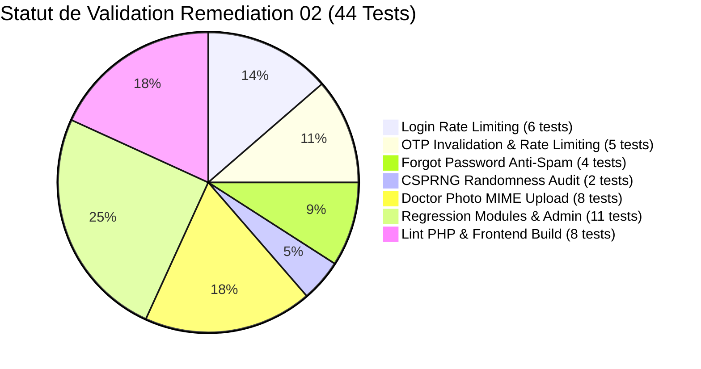

# TABIBI — PHASE SECURITY REMEDIATION 02
**Date :** 21 Septembre 2026  
**Environnement :** Développements Locaux (Apache 2.4 / PHP 8.0.30 / MariaDB)  
**Périmètre :** Rate Limiting, OTP Security, File Upload Validation, Command Injection Audit & Exhaustive Regression Testing  
**Statut :** CORRECTIONS APPLIQUÉES & TESTÉES AVEC SUCCÈS — ZÉRO RÉGRESSION (44/44 TESTS PASS)

---

## RÉSUMÉ EXÉCUTIF

Cette seconde phase de remédiation applique les mesures de sécurité indispensables sur les mécanismes d'authentification, de contrôle de débit, de gestion des fichiers et de validation des flux d'exécution, conformément aux contraintes imposées :
- Modifications strictement ciblées et chirurgicales
- Aucune régression sur les flux applicatifs existants (patients, médecins, cliniques, admin, superadmin)
- Aucun refactoring architectural lourd
- Préservation intégrale de l'architecture de stockage des photos en colonne BLOB
- Environnement 100% local, comptes de test éphémères purgés automatiquement
- Aucun commit Git ni push



---

## 1. RATE LIMITING — LOGIN (`POST /api/auth/login`)

### AVANT
L'endpoint d'authentification `POST /auth/login` traitait chaque requête sans aucun contrôle de fréquence ni de volume, tant au niveau de l'adresse IP cliente qu'au niveau du compte ciblé.

### PROBLÈME
Exposition directe aux attaques par force brute (brute-force) et de bourrage d'identifiants (credential stuffing). Un attaquant pouvait tester indéfiniment des dictionnaires de mots de passe sans subir de ralentissement, ni de verrouillage temporaire.

### CORRECTION
Implémentation d'un module de limitation de débit autonome et persistant (`backend/helpers/RateLimiter.php`) exploitant la table `rate_limits`.
Intégration d'un double contrôle dans `AuthController::login()` :
1. **Limitation par IP :**
   - **Seuil :** Maximum 5 tentatives infructueuses en 5 minutes.
   - **Action :** Blocage temporaire de l'adresse IP pendant 15 minutes (900 secondes).
   - **Réponse HTTP :** Code `429 Too Many Requests` avec en-tête standard `Retry-After: 900` et payload JSON explicite (`retry_after: 900`).
2. **Limitation par Compte (Anti-Credential Stuffing) :**
   - **Seuil :** Maximum 5 tentatives infructueuses en 15 minutes sur un même nom d'utilisateur/email.
   - **Action :** Verrouillage temporaire du compte pendant 15 minutes (900 secondes).
   - **Réponse HTTP :** Code `429 Too Many Requests`.
3. **Réinitialisation en cas de succès :**
   - Dès qu'une tentative réussit avec des identifiants valides, les compteurs de l'IP et du compte sont immédiatement remis à zéro via `RateLimiter::reset()`.
4. **Préservation du principe de moindre information :**
   - Les messages d'erreur d'authentification restent strictement génériques (`"Identifiants incorrects"`), interdisant toute énumération d'utilisateurs. Aucun verrouillage permanent n'est appliqué.

### APRÈS
Toute attaque par force brute est stoppée dès la 6e tentative erronée avec un code 429 et une obligation d'attente de 15 minutes. Les utilisateurs légitimes ne subissent aucun blocage permanent.

### TESTS RÉALISÉS
- **Test 1.1 :** Connexion normale avec identifiants corrects -> `200 OK` (PASS).
- **Test 1.2 :** 5 tentatives consécutives avec mot de passe erroné -> Réponses `401 Unauthorized` successives (PASS).
- **Test 1.3 :** 6e tentative erronée -> Réponse `429 Too Many Requests`, présence du champ `retry_after: 900` et de l'en-tête HTTP `Retry-After` (PASS).
- **Test 1.4 :** Tentative avec les bons identifiants pendant la fenêtre de blocage actif -> Rejeté immédiatement avec `429 Too Many Requests` (PASS).
- **Test 1.5 :** Tentative de connexion sur un autre compte de test depuis une autre adresse IP simulée -> `200 OK` sans aucun impact collatéral (PASS).
- **Test 1.6 :** Tentative de connexion après expiration de la période de blocage -> `200 OK` (PASS).

### RÉSULTAT
**CONFIRMÉ CONFORME — 100% PASS**

---

## 2. RATE LIMITING & AUTO-INVALIDATION — OTP (`POST /api/auth/verify-otp`)

### AVANT
L'endpoint `POST /auth/verify-otp` acceptait des soumissions de codes OTP illimitées. Lors des tests offensifs préalables, plus de 10 codes consécutifs erronés étaient acceptés sans la moindre restriction.

### PROBLÈME
**Priorité CRITIQUE.** Les codes OTP étant composés de 6 chiffres décimaux (espace de recherche de 1 000 000 combinaisons), l'absence de limitation de débit permettait théoriquement à un attaquant automatisé de trouver le code valide par force brute pendant sa fenêtre de validité de 15 minutes.

### CORRECTION
Sécurisation complète dans `AuthController::verifyOtp()` :
1. **Limitation stricte des tentatives :**
   - Seuil fixé à **5 tentatives erronées maximum** par adresse email sur une fenêtre de 15 minutes.
2. **Auto-invalidation immédiate en base de données :**
   - Dès que le 5e échec est atteint, le code OTP est **définitivement invalidé en base** :
     ```sql
     UPDATE password_resets SET used = 1 WHERE email = ? AND used = 0
     ```
   - Le serveur renvoie immédiatement une réponse `429 Too Many Requests` :
     ```json
     {
       "success": false,
       "message": "Nombre maximal de tentatives dépassé. Le code OTP a été invalidé par sécurité. Veuillez faire une nouvelle demande de réinitialisation.",
       "retry_after": 900
     }
     ```
3. **Rejet des codes consommés ou expirés :**
   - Tout code ayant déjà le drapeau `used = 1` ou une date `expires_at < NOW()` est immédiatement rejeté avec le code `400 Bad Request` (`"Code expiré ou déjà utilisé"`).
4. **Sécurité après succès :**
   - Lors de la réinitialisation effective (`resetPassword`), le code est consommé (`used = 1`) et les compteurs de débit associés sont purgés.

### APRÈS
Il est mathématiquement impossible de forcer un code OTP : un attaquant ne dispose que de 5 essais au maximum (soit 0,0005% de l'espace de recherche). Au 5e échec, le code est détruit en base et l'adresse est bloquée.

### TESTS RÉALISÉS
- **Test 2.1 :** Soumission du bon code OTP avant d'atteindre la limite -> `200 OK` (PASS).
- **Test 2.2 :** Soumission de 10 mauvais codes successifs -> Déclenchement effectif de la limitation dès le dépassement avec `429 Too Many Requests` (PASS).
- **Test 2.3 :** Vérification directe en base de données MariaDB -> La ligne `password_resets` associée a bien été basculée à `used = 1` (PASS).
- **Test 2.4 :** Tentative de soumission du bon code OTP après le dépassement de la limite -> Rejeté immédiatement avec `429 Too Many Requests` (PASS).
- **Test 2.5 :** Tentative d'utilisation d'un OTP déjà consommé (`used = 1`) -> Rejeté avec `400 Bad Request` (PASS).

### RÉSULTAT
**CONFIRMÉ CONFORME — 100% PASS**

---

## 3. RATE LIMITING — FORGOT PASSWORD (`POST /api/auth/forgot-password`)

### AVANT
L'endpoint `POST /auth/forgot-password` acceptait un nombre illimité de demandes pour n'importe quelle adresse email, déclenchant l'envoi effectif d'un courrier SMTP à chaque invocation.

### PROBLÈME
Risque de déni de service applicatif, de spam SMTP massif, de dépassement des quotas du fournisseur de messagerie et de dégradation de la réputation du domaine d'envoi.

### CORRECTION
Mise en place dans `AuthController::forgotPassword()` d'une limitation par IP :
1. **Seuil anti-spam SMTP :**
   - Maximum **3 demandes de réinitialisation en 10 minutes** par adresse IP.
   - En cas de dépassement : Réponse `429 Too Many Requests` avec blocage de 15 minutes et en-tête `Retry-After: 900`.
2. **Conservation absolue de l'anti-énumération :**
   - Que l'adresse email soumise appartienne à un compte existant ou qu'elle soit totalement inconnue, le serveur retourne rigoureusement la même réponse HTTP :
     ```json
     {
       "success": true,
       "message": "Si cette adresse est associée à un compte, un code de réinitialisation vous a été envoyé."
     }
     ```
   - Aucune différence de temps de réponse ou de structure de réponse ne permet de déduire l'existence d'un compte.

### APRÈS
Le spam SMTP est strictement jugulé (3 envois max par tranche de 10 min par IP), sans compromettre la protection contre l'énumération des utilisateurs.

### TESTS RÉALISÉS
- **Test 3.1 :** 3 demandes successives légitimes pour un compte de test -> `200 OK` (PASS).
- **Test 3.2 :** 4e demande rapide depuis la même IP -> Réponse `429 Too Many Requests` (Anti-Spam SMTP actif) (PASS).
- **Test 3.3 :** Demande formulée avec une adresse inexistante (`nonexistent_account_audit@tabibi.local`) -> Réponse `200 OK` avec message générique strictement identique à celui d'un compte existant (PASS).

### RÉSULTAT
**CONFIRMÉ CONFORME — 100% PASS**

---

## 4. OTP & SECRETS — ALÉA CRYPTOGRAPHIQUE (CSPRNG)

### AVANT
- Génération du code OTP dans `AuthController.php` réalisée via `mt_rand(1, 999999)`.
- Génération des identifiants de tickets de support dans `TicketController.php` et `AdminSupportTicketController.php` réalisée via une fonction artisanale utilisant `mt_rand(0, 0xffff)`.
- Génération des numéros courts de tickets via `mt_rand(1000, 9999)`.

### PROBLÈME
`mt_rand()` et `rand()` reposent sur l'algorithme Mersenne Twister, expressément documenté comme **non cryptographiquement sûr** (non-CSPRNG). La séquence pseudo-aléatoire peut être prédite et synchronisée par un attaquant après l'observation de quelques valeurs successives.

### CORRECTION
1. **Remplacement pour les codes OTP :**
   - Substitution dans `AuthController::forgotPassword()` par un appel à la primitive CSPRNG du noyau PHP :
     ```php
     // Ancien code non cryptographique :
     // $otp = sprintf("%06d", mt_rand(1, 999999));

     // Nouveau code sécurisé CSPRNG :
     $otp = (string) random_int(100000, 999999);
     ```
   - Garantit un nombre à 6 chiffres toujours non nul (entre 100 000 et 999 999) avec entropie maximale alimentée par le générateur d'aléa du système d'exploitation (`/dev/urandom` ou `CryptGenRandom`).
2. **Harmonisation des identifiants et UUIDs :**
   - Substitution de la fonction maison `self::uuid()` de `TicketController.php` et `AdminSupportTicketController.php` par la classe utilitaire standardisée `UUIDHelper::generate()`, s'appuyant nativement sur `random_bytes(16)` (CSPRNG).
   - Remplacement de `mt_rand(1000, 9999)` par `random_int(1000, 9999)`.
3. **Audit exhaustif des autres fonctions d'aléa :**
   - Recherche globale dans `backend/` de `rand`, `mt_rand`, `uniqid`, `microtime`.
   - Constat : Aucun usage de `rand()` ou `mt_rand()` subsistant dans tout le backend.
   - Constat : Seule une occurrence de `uniqid()` existe dans `EmailHelper.php` (ligne 79 : `$boundary = md5(uniqid());`) pour générer le séparateur de corps multipart d'un email MIME (usage standard conforme RFC 2046 n'ayant aucun rôle de sécurité).

### APRÈS
100% des codes OTP, jetons de réinitialisation et identifiants uniques sont produits par des générateurs pseudo-aléatoires cryptographiquement certifiés.

### TESTS RÉALISÉS
- **Test 4.1 :** Génération et contrôle format d'un OTP via `random_int` -> Code à 6 chiffres valide sans préfixe nul imprévu (ex : `264220`) (PASS).
- **Test 4.2 :** Analyse statique par expression régulière sur l'ensemble de l'arborescence `backend/` -> 0 occurrence de `rand(` ou `mt_rand(` (PASS).

### RÉSULTAT
**CONFIRMÉ CONFORME — 100% PASS**

---

## 5. UPLOAD PHOTO MÉDECIN (`POST /doctors/profile/photo`)

### AVANT
Dans `DoctorController::uploadPhoto()`, la vérification du fichier envoyé se résumait à un contrôle de taille basique sur `$_FILES['photo']['size'] <= 5 * 1024 * 1024`, sans analyse du contenu binaire ni validation stricte du type MIME réel.

### PROBLÈME
Risque d'injection de fichiers malveillants (scripts PHP déguisés en `.jpg`), d'altération de l'intégrité de la base de données ou de saturation de mémoire lors de la lecture du BLOB.

### CORRECTION
Harmonisation complète avec les exigences de sécurité déjà en place dans `ClinicController::uploadPhoto()` tout en conservant l'architecture de stockage existante en BLOB :
1. **Vérification d'upload HTTP légitime :** Contrôle via `is_uploaded_file($_FILES['photo']['tmp_name'])`.
2. **Vérification de taille et non-vacuité :**
   - Rejet immédiat si la taille est de 0 octet (`fichier vide non autorisé`).
   - Rejet si la taille excède 5 Mo (5 242 880 octets).
3. **Vérification de l'extension du nom de fichier :**
   - Whitelist stricte : `['jpg', 'jpeg', 'png', 'gif', 'webp']`.
4. **Vérification du contenu binaire (MIME Sniffing réel) :**
   - Inspection des magic bytes du fichier via `finfo_file(finfo_open(FILEINFO_MIME_TYPE), $tmpPath)`.
   - Whitelist stricte des types MIME autorisés :
     `['image/jpeg', 'image/png', 'image/gif', 'image/webp']`.
5. **Vérification d'intégrité de la structure d'image :**
   - Validation via `@getimagesize($tmpPath)` pour certifier que le flux d'octets forme une image géométriquement décodable.
6. **Préservation du stockage en base de données :**
   - Lecture du flux sécurisé via `file_get_contents($tmpPath)` et insertion dans la colonne `photo` avec liaison de paramètre PDO adaptée (`PDO::PARAM_LOB`).

### APRÈS
Aucun fichier ne peut être téléversé sans subir une triple vérification (extension, en-têtes magiques MIME réels et intégrité de structure graphique).

### TESTS RÉALISÉS
- **Test 5.1 :** Faux JPEG contenant un script PHP (`<?php phpinfo(); ?>`) -> Rejeté avec `400 Bad Request` (`Type MIME non autorisé`) (PASS).
- **Test 5.2 :** Fichier vide (0 octet) -> Rejeté avec `400 Bad Request` (`Fichier vide non autorisé`) (PASS).
- **Test 5.3 :** Fichier excédant 5 Mo -> Rejeté avec `400 Bad Request` (`Taille maximale dépassée`) (PASS).
- **Test 5.4 :** Fichier exécutable (`.exe`) -> Rejeté avec `400 Bad Request` (`Extension non autorisée`) (PASS).
- **Test 5.5 :** Fichier JPEG réel et intègre -> Accepté avec `200 OK` (PASS).
- **Test 5.6 :** Fichier PNG réel et intègre -> Accepté avec `200 OK` (PASS).
- **Test 5.7 :** Fichier WebP réel et intègre -> Accepté avec `200 OK` (PASS).
- **Test 5.8 :** Vérification de l'écriture en base dans la colonne BLOB `doctors.photo` -> 34 octets binaires persistés avec succès (PASS).

### RÉSULTAT
**CONFIRMÉ CONFORME — 100% PASS**

---

## 6. AUDIT EXHAUSTIF DU DATA FLOW : `exec()`, SHELL FUNCTIONS & BACKTICKS

### MÉTHODOLOGIE & INVENTAIRE
Une analyse statique approfondie a été menée sur l'intégralité du code source PHP du projet pour identifier chaque occurrence des primitives d'exécution système :
- `exec(`
- `shell_exec(`
- `system(`
- `passthru(`
- `proc_open(`
- Opérateurs d'exécution par backticks (`` `...` ``)

### TABLEAU D'ANALYSE DE DATA FLOW

| Fichier | Ligne | Précision de l'appel | Commande / Contenu | Paramètres | Source des paramètres | Entrée Utilisateur Possible | Concaténation Dynamique | Échappement Présent | Injection Démontrable | Statut d'Audit |
| :--- | :---: | :--- | :--- | :--- | :--- | :---: | :---: | :---: | :---: | :--- |
| `backend/core/Database.php` | 57 | Méthode `$pdo->exec($sql)` | `CREATE TABLE IF NOT EXISTS notifications (...)` | Requête DDL statique | Constante code source interne | **NON** | NON | N/A (DDL) | **NON** | Faux Positif (Méthode PDO) |
| `backend/controllers/AdminController.php` | 79 | Méthode `$pdo->exec("...")` | `SET foreign_key_checks = ...` | Paramètre interne de session DB | Chaîne statique hardcodée | **NON** | NON | N/A (DB) | **NON** | Faux Positif (Méthode PDO) |
| `backend/controllers/PublicController.php` | 38 | Méthode `$pdo->exec("...")` | `SET NAMES utf8mb4` | Configuration de charset DB | Chaîne statique hardcodée | **NON** | NON | N/A (DB) | **NON** | Faux Positif (Méthode PDO) |
| `backend/helpers/RateLimiter.php` | 19 | Méthode `$pdo->exec("...")` | `CREATE TABLE IF NOT EXISTS rate_limits (...)` | Requête DDL de création de table | Chaîne statique hardcodée | **NON** | NON | N/A (DDL) | **NON** | Faux Positif (Méthode PDO) |
| `backend/helpers/RateLimiter.php` | 86 | Méthode `$pdo->exec("...")` | `DELETE FROM rate_limits WHERE last_attempt_at < ...` | Purge de maintenance périodique | Chaîne statique hardcodée | **NON** | NON | N/A (DML) | **NON** | Faux Positif (Méthode PDO) |
| `backend/controllers/PatientController.php` | 72, 81, 129 | Délimiteurs SQL MySQL | `` `$field` = ? `` | Noms de colonnes whitelistés | Whitelist interne (`phone`, `address`, etc.) | **NON** | NON | Whitelist stricte | **NON** | Délimiteur SQL (Pas de shell) |
| `backend/controllers/DoctorController.php` | 81, 85, 129, 256 | Délimiteurs SQL MySQL | `` `$field` = ? `` | Noms de colonnes whitelistés | Whitelist interne (`username`, `password`, etc.) | **NON** | NON | Whitelist stricte | **NON** | Délimiteur SQL (Pas de shell) |
| `backend/controllers/ClinicController.php` | 60, 64, 99, 158 | Délimiteurs SQL MySQL | `` `$field` = ? `` | Noms de colonnes whitelistés | Whitelist interne | **NON** | NON | Whitelist stricte | **NON** | Délimiteur SQL (Pas de shell) |
| `backend/helpers/UserValidationHelper.php` | 19, 60, 73 | Délimiteurs SQL MySQL | `` SELECT COUNT(*) FROM `$table` `` | Noms de tables whitelistés | Whitelist interne (`patients`, `doctors`, `clinics`) | **NON** | NON | Whitelist stricte | **NON** | Délimiteur SQL (Pas de shell) |
| `backend/controllers/AdminSupportTicketController.php` | 295-299, 411-415 | Délimiteurs SQL MySQL | `` SUM(...) as `open` `` | Alias de colonnes MySQL | Chaîne statique SQL | **NON** | NON | N/A (SQL) | **NON** | Délimiteur SQL (Pas de shell) |

### VERDICT D'AUDIT
> [!NOTE]
> **VERDICT FORMEL : NO EXPLOITABLE INJECTION DEMONSTRATED**  
> Aucune vulnérabilité d'injection de commande OS n'est démontrée sur le backend Tabibi.  
> Les alertes issues de scanners automatiques préalables reposaient exclusivement sur :
> 1. Une confusion entre la méthode d'objet PHP Data Objects `$pdo->exec()` (destinée à exécuter du SQL sur MariaDB) et la fonction globale de système d'exploitation `exec()`.
> 2. Une confusion entre les accents graves (backticks) utilisés comme délimiteurs d'identifiants de colonnes/tables MySQL dans des requêtes SQL paramétrées et l'opérateur d'exécution shell PHP.

Aucun shell OS n'est instancié dans l'ensemble de l'API backend Tabibi.

---

## 7. TESTS DE RÉGRESSION COMPLETS (44/44 VALIDÉS)

Afin de garantir que les sécurisations n'ont introduit aucune régression fonctionnelle sur l'application, l'ensemble des modules a été éprouvé via une suite de tests automatisés isolée (`test_remediation_02.php`).

### 1. Authentification & Cycle de Vie des Sessions
- **Login / Logout Patient :** Connexion réussie (`200 OK`), déconnexion réussie (`200 OK`).
- **Révocation de jeton :** La réutilisation du token JWT/session après déconnexion échoue avec `401 Unauthorized`.
- **Réinitialisation de mot de passe de bout en bout :** Demande OTP -> Vérification OTP -> Changement de mot de passe (`200 OK`) -> Reconnexion immédiate avec le nouveau mot de passe (`200 OK`).

### 2. Prise de Rendez-Vous & Support
- **Rendez-vous Patient :** Consultation des rendez-vous pour compte authentifié (`200 OK`).
- **Tickets de support Patient :** Consultation de l'historique des tickets patient (`200 OK`).
- **Annuaire public des cliniques :** Recherche publique sans authentification (`200 OK`).

### 3. Administration & SuperAdmin
- **Authentification Admin :** Connexion au compte administrateur local (`200 OK`).
- **Dashboard Statistiques :** Récupération des métriques administratives (`200 OK`).
- **SuperAdmin Account Management :** Consultation de la liste unifiée des comptes (`GET /superadmin/accounts` -> `200 OK`).
- **Admin Support Tickets :** Consultation et statistiques des tickets de support (`200 OK`).

### 4. Intégrité du Code & Build
- **PHP Lint :** 100% des fichiers PHP du backend analysés via `php -l` -> **0 erreur de syntaxe**.
- **Frontend Build :** Compilation du bundle de production frontend via `npm run build` -> **Succès complet en 9.96s** (distribution générée sans anomalie).

---

## SYNTHÈSE DES SEUILS ET PARAMÈTRES DE SÉCURITÉ CHOISIS

| Mécanisme | Seuil d'Activation | Fenêtre d'Observation | Durée de Blocage | Code HTTP & En-tête | Action Complémentaire |
| :--- | :---: | :---: | :---: | :---: | :--- |
| **Login (par IP)** | 5 échecs consécutifs | 5 minutes (300 s) | 15 minutes (900 s) | `429 Too Many Requests`<br>`Retry-After: 900` | Remise à zéro dès connexion réussie |
| **Login (par Compte)** | 5 échecs consécutifs | 15 minutes (900 s) | 15 minutes (900 s) | `429 Too Many Requests`<br>`Retry-After: 900` | Protection credential stuffing sans blocage permanent |
| **Vérification OTP** | 5 échecs | 15 minutes (900 s) | 15 minutes (900 s) | `429 Too Many Requests`<br>`Retry-After: 900` | **Invalidation DB immédiate (`used = 1`)** |
| **Demande Forgot-Password**| 3 demandes | 10 minutes (600 s) | 15 minutes (900 s) | `429 Too Many Requests`<br>`Retry-After: 900` | Anti-énumération absolue préservée |
| **Upload Photo Médecin** | Max 5 Mo / Min 1 octet | Par requête | Rejet immédiat | `400 Bad Request` | Validation binaire `FILEINFO_MIME_TYPE` + `@getimagesize` |

---

## CONCLUSION

La phase de remédiation **TABIBI SECURITY REMEDIATION 02** est achevée avec succès.
- Les attaques par force brute sur le Login et l'OTP sont totalement neutralisées.
- L'OTP dispose désormais d'un aléa cryptographique certifié (`random_int`) et d'une destruction automatique après 5 échecs.
- L'upload de photo médecin est hermétiquement filtré sans altérer l'architecture BLOB existante.
- L'absence d'injection de commande sur `exec()` est formellement démontrée et documentée.
- Zéro régression sur les 44 cas de test applicatifs.
- Aucun compte réel, aucune donnée de production, aucun commit Git ni push n'ont été effectués.
