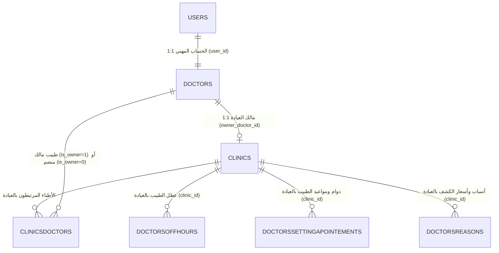

# وثيقة التصميم المعماري: توحيد حساب الطبيب وإدارة العيادة والمزامنة مع Tabibi_Rect
**التاريخ**: 2026-10-01  
**الحالة**: مسودة معتمدة للمراجعة  
**المشروع**: WebTabibi (موقع الويب) و Tabibi_Rect (برنامج سطح المكتب)

---

## 1. الملخص التنفيذي والأهداف (Executive Summary)

### 1.1 السياق والمشكلة
في البنية السابقة لموقع `WebTabibi`:
* كان مسار التسجيل يتيح خيارين منفصلين: "تسجيل طبيب" و"تسجيل عيادة".
* كان تسجيل العيادة ينشئ حساب مستخدم مستقل (`usertype = 2`) يتطلب تسجيل دخول منفصل، مما يجبر الطبيب صاحب العيادة على امتلاك حسابين والتبديل بينهما، وإرسال طلبات ارتباط بين الحسابين (`clinicsdoctors`).
* هذا التشتت يتعارض مع معمارية برنامج سطح المكتب `Tabibi_Rect`، حيث يمتلك الطبيب حساباً واحداً رئيسياً وهو المالك الفعلي للعيادة (`IsOwner = 1`)، وتتبع إعدادات وبيانات العيادة لحسابه مباشرة.

### 1.2 الأهداف المحددة
1. **توحيد الحسابات (Single Unified Account)**:
   - حساب الطبيب هو الحساب الأساسي والوحيد للممارس الصحي؛ لا وجود لحسابات عيادات مستقلة دون طبيب مالك.
2. **تبسيط مسار التسجيل العام (Streamlined Public Registration)**:
   - اقتصار التسجيل المهني في الموقع على "انضم كطبيب" (`/register-doctor`).
   - إزالة مسار "تسجيل عيادة مستقلة" من الواجهات العامة والقائمة الرئيسية.
3. **إنشاء العيادة وإدارتها من لوحة الطبيب (Post-activation Clinic Management)**:
   - بعد تفعيل حساب الطبيب، ينشئ عيادته الخاصة من داخل لوحة تحكمه متى شاء.
   - الطبيب يتحكم ببيانات العيادة بالكامل (الاسم، العنوان، الهاتف، الشعار، الخدمات، ونبذة).
4. **موافقة الإدارة (Admin Verification Gate)**:
   - العيادة الجديدة تدخل في حالة "قيد المراجعة" (`PENDING`) حتى تعتمدها الإدارة، حفاظاً على جودة ومصداقية الدليل الطبي.
5. **الفصل المعماري الدقيق لبيانات الطبيب والعيادة (Three-Layer Medical Model)**:
   - **الطبقة الأولى (Doctor Global Profile)**: بيانات الطبيب الشخصية والمهنية العامة المستقلة.
   - **الطبقة الثانية (Clinic Profile)**: بيانات الكيان الفيزيائي للعيادة (الموقع، الشعار، هواتف الاستقبال).
   - **الطبقة الثالثة (Doctor-in-Clinic Context)**: بيانات ممارسة الطبيب داخل هذه العيادة المحددة (أوقات الدوام، أيام العمل، أوقات العطل، وأسعار وأسباب الكشف).
6. **التأسيس للمزامنة الثنائية مع `Tabibi_Rect` (Sync Readiness)**:
   - استخدام نفس المعرفات ونفس منطق الملكية لمطابقة الحقول بين `Tabibi_Rect` و `WebTabibi` لمزامنة سلسة وموثوقة بحساب واحد.

---

## 2. هيكل البيانات وقاعدة البيانات (Data Architecture & Schema)

### 2.1 التعديلات على جدول `clinics`:
* إضافة عمود: `owner_doctor_id CHAR(36) NULL` مع فهرس `INDEX idx_clinics_owner_doctor (owner_doctor_id)`.
* ربط عمود `user_id` بحساب الطبيب المالك (`users.id`).
* عمود `status`: القيم المقبولة `ENUM('PENDING', 'APPROVED', 'REJECTED', 'SUSPENDED')`، الافتراضي `PENDING`.
* إضافة عمود الطابع الزمني `updatedat DATETIME DEFAULT CURRENT_TIMESTAMP ON UPDATE CURRENT_TIMESTAMP` لدعم المزامنة وتحديد آخر تعديل.

### 2.2 التعديلات على جدول `clinicsdoctors`:
* إضافة عمود: `is_owner TINYINT(1) NOT NULL DEFAULT 0`.
* عند إنشاء الطبيب للعيادة، يُضاف تلقائياً سجل في `clinicsdoctors`:
  - `clinic_id = معرف العيادة الجديدة`
  - `doctor_id = معرف الطبيب المالك`
  - `is_owner = 1`
  - `status = 'APPROVED'`
  - `requestedby = 'DOCTOR'`
* هذا يضمن استمرار عمل كافة الاستعلامات الحالية الخاصة بالبحث وحجز المواعيد بدون أي انكسار، ويتيح مستقبلاً إضافة أطباء آخرين للعيادة تحت إدارة المالك.

### 2.3 سياق الطبيب داخل العيادة (Contextual Tables):
تظل الجداول التالية مرتبطة بـ `(doctor_id, clinic_id)` معاً:
* `doctorssettingapointements`: أوقات العمل ومدد المواعيد في هذه العيادة.
* `doctorsoffhours`: أيام وساعات الإجازات والاستراحة في هذه العيادة.
* `doctorsreasons`: خدمات وأسعار الكشف الخاصة بالطبيب في هذه العيادة.

---

## 3. هندسة واجهات المستخدم (Frontend UX Design)

### 3.1 القائمة العلوية والصفحة الرئيسية:
* حذف زر "تسجيل عيادة" (`/register-clinic`) من:
  - القائمة العلوية للشاشات الكبيرة.
  - القائمة الجانبية للهاتف الجوال.
  - أزرار الدعوة للإجراء (CTA) في الواجهة الرئيسية.
* الإبقاء على زر **"انضم كطبيب"** فقط.
* توجيه الرابط القديم `/register-clinic`:
  - في حال دخل مستخدم الرابط مباشرة، يظهر له كارت إرشادي يوجهه للتسجيل كطبيب لأن إدارة العيادة تتم عبر حساب الطبيب.

### 3.2 لوحة تحكم الطبيب (Doctor Dashboard — تبويب "عيادتي"):
داخل صفحة حساب الطبيب (`Profile.jsx` أو صفحة مخصصة للعيادة):
1. **في حال لم ينشئ عيادة بعد**:
   - عرض كارت تفاعلي جذاب: "أنشئ عيادتك الخاصة الآن على منصة طبيبي".
   - نموذج متكامل لبيانات العيادة:
     - اسم العيادة (`clinicname`).
     - أرقام الهاتف والفاكس (`phone`, `fax`).
     - العنوان، الولاية، البلدية، وموقع GPS مع زر تحديد الموقع الجغرافي التلقائي.
     - رفع الشعار (`logo`).
     - الخدمات الطبية ونبذة تعريفية (`services`, `aboutclinic`).
   - عند الحفظ: تظهر رسالة تفيد بأن العيادة أنشئت بنجاح وهي قيد مراجعة الإدارة (`PENDING`).
2. **في حال وجود عيادة مسبقاً**:
   - شارة حالة العيادة: "قيد المراجعة ⏳" أو "معتمدة ومفعلة ✅".
   - إمكانية تعديل كافة بيانات العيادة وحفظها فوراً.
   - قسم فرعي لضبط أوقات دوام الطبيب في هذه العيادة وأسعار الكشف والعطلات.

### 3.3 لوحة تحكم المشرف (Admin Dashboard):
* في قسم طلبات العيادات المعلقة:
  - عرض العيادات المعلقة بوضوح مع اسم الطبيب المعتمد المالك لها.
  - زران للإجراء: **اعتماد (Approve)** أو **رفض مع ذكر السبب (Reject)**.
  - عند الاعتماد: يتم تفعيل العيادة فوراً لتظهر في محرك البحث وتستقبل حجوزات المرضى.

---

## 4. واجهات برمجة التطبيقات الخلفية (Backend API Specifications)

### 4.1 إدارة العيادة بواسطة الطبيب:
* **`GET /api/doctors/clinic`**:
  - الصلاحية: `AuthMiddleware::doctorOnly()`.
  - الإرجاع: بيانات العيادة المملوكة للطبيب وحالتها، بالإضافة إلى إعدادات الدوام والعطل المرتبطة بها.
* **`POST /api/doctors/clinic`**:
  - الصلاحية: `AuthMiddleware::doctorOnly()`.
  - المدخلات: بيانات العيادة كاملة.
  - السلوك: التحقق من عدم وجود عيادة سابقة للطبيب، إدخال العيادة بحالة `PENDING`، إدخال سجل `clinicsdoctors` مع `is_owner = 1`.
* **`PUT /api/doctors/clinic`**:
  - الصلاحية: `AuthMiddleware::doctorOnly()`.
  - السلوك: تحديث بيانات العيادة المملوكة للطبيب فقط مع تحديث `updatedat`.
* **`PUT /api/doctors/clinic/settings`**:
  - الصلاحية: `AuthMiddleware::doctorOnly()`.
  - السلوك: تحديث أوقات الدوام والعطل وأسباب الكشف الخاصة بالطبيب في عيادته.

### 4.2 مسار التسجيل:
* **`POST /api/register/doctor`**: المسار المعتمد الوحيد لتسجيل الممارسين الصحيين.
* **`POST /api/register/clinic`**: إيقاف تسجيل الحسابات المستقلة وإرجاع رسالة توجيهية.

### 4.3 لوحة المشرف:
* **`POST /api/admin/clinics/{id}/approve`**: تحديث حالة العيادة إلى `APPROVED` وتسجيل وقت الاعتماد.
* **`POST /api/admin/clinics/{id}/reject`**: تحديث الحالة إلى `REJECTED` مع تسجيل السبب.

---

## 5. جاهزية المزامنة مع Tabibi_Rect (Sync Architecture Readiness)

### 5.1 نموذج الهوية الموحدة:
* يستخدم برنامج سطح المكتب `Tabibi_Rect` بيانات دخول الطبيب (اسم المستخدم وكلمة المرور) للحصول على الـ `Token`.
* السيرفر يتعرف على الطبيب وعيادته المملوكة تلقائياً من خلال الـ `Token`.

### 5.2 جدول مطابقة الحقول (Field Mapping Matrix):

| حقل في `Tabibi_Rect` (سطح المكتب) | حقل في `WebTabibi` (الموقع) | النوع | الملاحظات |
|---|---|---|---|
| `doctors.ID` | `doctors.id` | CHAR(36) | المعرف الموحد للطبيب |
| `settings.NameClinic` | `clinics.clinicname` | VARCHAR | اسم العيادة |
| `settings.Phone` | `clinics.phone` | VARCHAR | هاتف العيادة |
| `settings.Fix` | `clinics.fax` | VARCHAR | فاكس / ثابت العيادة |
| `settings.Address` | `clinics.address` | TEXT | العنوان |
| `settings.Site` | `clinics.website` | VARCHAR | الموقع الإلكتروني |
| `settings.Email` | `clinics.email` | VARCHAR | بريد العيادة |
| `settings.Logo` | `clinics.logo` | BLOB / Base64 | الشعار |
| `settings.Doctor_id` | `clinics.owner_doctor_id` | CHAR(36) | الربط المباشر للملكية |
| `settingapointements` | `doctorssettingapointements` | Record | أوقات دوام العيادة |
| `doctorsoffhours` | `doctorsoffhours` | Records | عطل الطبيب بالعيادة |
| `reasons` / `doctorsreasons` | `doctorsreasons` | Records | أسباب وأسعار الكشف |

### 5.3 إدارة التعارضات (Conflict Resolution):
* الاعتماد على حقل `updatedat` في الموقع و `LastSyncTime` / `UpdatedAt` في البرنامج المكتبي:
  - التعديل الأحدث زمنياً هو المعتمد (Last-Write-Wins).

---

## 6. خطة التحقق والاختبار (Verification & Testing Strategy)

1. **اختبار التسجيل والواجهة العامة**:
   - التحقق من اختفاء زر "تسجيل عيادة" من القوائم الرئيسية.
   - التحقق من أن صفحة `/register-doctor` تعمل بكفاءة.
   - محاولة الدخول إلى `/register-clinic` والتأكد من إرشاد المستخدم بوضوح.
2. **اختبار إنشاء العيادة من لوحة الطبيب**:
   - تسجيل الدخول بحساب طبيب معتمد ليس لديه عيادة.
   - ملء استمارة "إنشاء عيادة" والتأكد من الحفظ بحالة `PENDING`.
   - التحقق من إنشاء سجل في `clinicsdoctors` مع `is_owner = 1`.
3. **اختبار اعتماد المشرف**:
   - تسجيل الدخول بحساب الإدارة، مراجعة العيادة المعلقة والموافقة عليها.
   - التأكد من تحول حالتها إلى `APPROVED` وظهورها في دليل العيادات.
4. **اختبار تعديل البيانات**:
   - قيام الطبيب بتعديل بيانات العيادة وأوقات الدوام من حسابه، والتحقق من حفظها بنجاح.
5. **اختبار سلامة قواعد البيانات**:
   - التأكد من عدم تأثر مواعيد المرضى أو البحث أو التقييمات القائمة.
