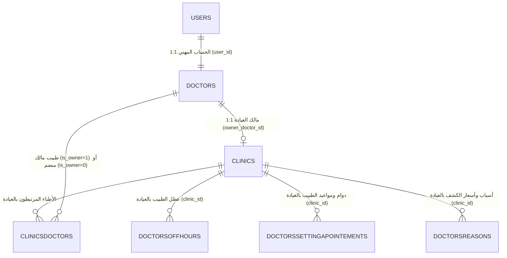

# وثيقة التصميم المعماري: توحيد حساب الطبيب والاعتماد الموحد للعيادة والمزامنة مع Tabibi_Rect
**التاريخ**: 2026-10-01  
**الحالة**: معتمد للتنفيذ (الخيار 3 - الاعتماد الموحد والإنشاء الفوري الذاتي)  
**المشروع**: WebTabibi (موقع الويب) و Tabibi_Rect (برنامج سطح المكتب)

---

## 1. الملخص التنفيذي والأهداف (Executive Summary)

### 1.1 السياق والمشكلة
* في البنية السابقة لموقع `WebTabibi`:
  - كان مسار التسجيل يتيح خيارين منفصلين: "تسجيل طبيب" و"تسجيل عيادة".
  - كان تسجيل العيادة ينشئ حساب مستخدم مستقل (`usertype = 2`) يتطلب تسجيل دخول منفصل، مما يجبر الطبيب صاحب العيادة على امتلاك حسابين والتبديل بينهما، وإرسال طلبات ارتباط بين الحسابين (`clinicsdoctors`).
  - كان المقترح السابق يفرض انتظار موافقة ثانية من الإدارة (`PENDING`) لإنشاء العيادة بعد موافقة حساب الطبيب، مما يسبب إحباطاً وتعطيلاً غير مبرر للطبيب (Approval Fatigue).

### 1.2 الأهداف المحددة (الخيار 3 - المعتمد)
1. **مسار تسجيل موحد وشامل (All-in-One Registration - Pattern A)**:
   - يتضمن نموذج "انضم كطبيب" بيانات الطبيب الشخصية والمهنية + بيانات مقره/عيادته الأساسية (اسم المقر، الولاية، البلدية، العنوان، وهاتف العيادة).
2. **الاعتماد الإداري بضغطة زر واحدة (One-Click Admin Approval)**:
   - مراجعة الإدارة تتركز على أهلية الطبيب وهويته.
   - عند موافقة المشرف على طلب الطبيب: يُنشأ حساب الطبيب (`status = 'APPROVED'`) وتُنشأ عيادته فوراً وتُعتمد (`status = 'APPROVED'`) وتُربط به كمالك (`is_owner = 1`) في خطوة ذرية واحدة (Atomic Transaction).
3. **الإنشاء الذاتي الفوري للطبيب المعتمد (Self-Serve Setup - Pattern B)**:
   - للأطباء المعتمدين مسبقاً، عند إنشاء عيادة من لوحة التحكم (`DoctorClinicManager`)، يتم تفعيل العيادة فوراً (`APPROVED`) دون اشتراط موافقة ثانية من الإدارة، لأن هوية الطبيب موثقة بالفعل.
4. **الرقابة الإدارية الدائمة (Governance & Safety Gate)**:
   - للإدارة الصلاحية الدائمة في لوحة التحكم لتعديل أو تجميد (`Freeze`) أو تعليق (`Suspend`) أي عيادة مخالفة في أي لحظة.
5. **الفصل المعماري الدقيق (Three-Layer Medical Model)**:
   - **الطبقة الأولى (Doctor Global Profile)**: بيانات الطبيب الشخصية والمهنية العامة.
   - **الطبقة الثانية (Clinic Profile)**: بيانات الكيان الفيزيائي للعيادة (الموقع، الشعار، الهاتف).
   - **الطبقة الثالثة (Doctor-in-Clinic Context)**: سياق ممارسة الطبيب في المقر (الدوام، العطل، الأسعار عبر `clinicsdoctors`).
6. **التكامل الفوري مع `Tabibi_Rect` (Zero-Delay Desktop Sync)**:
   - الطبيب بمجرد اعتماده يستطيع فتح برنامج سطح المكتب في عيادته والبدء فوراً دون أي خطوة انتظار وسيطة.

---

## 2. هيكل البيانات وقاعدة البيانات (Data Architecture & Schema)

### 2.1 التعديلات على جدول `clinics`:
* `owner_doctor_id CHAR(36) NULL` مع فهرس `INDEX idx_clinics_owner_doctor (owner_doctor_id)`.
* `user_id` يرتبط بـ `users.id` للطبيب المالك.
* `status`: القيم المقبولة `ENUM('APPROVED', 'PENDING', 'REJECTED', 'SUSPENDED')`، عند الإنشاء بواسطة طبيب معتمد تكون القيمة **`APPROVED`**.
* الطابع الزمني `updatedat DATETIME DEFAULT CURRENT_TIMESTAMP ON UPDATE CURRENT_TIMESTAMP`.

### 2.2 جدول `doctorregistrations`:
* يحتوي على الحقول:
  - بيانات الطبيب: `fullname`, `speciality`, `email`, `phone`, `password`, `nin`, `doctor_id`.
  - بيانات العيادة/المقر: `clinicname`, `clinic_wilaya_id`, `clinic_baladiya_id`, `clinic_address`, `clinic_phone`.

### 2.3 جدول `clinicsdoctors`:
* عمود `is_owner TINYINT(1) NOT NULL DEFAULT 0`.
* عند إنشاء العيادة، يضاف تلقائياً سجل:
  - `clinic_id = معرف العيادة`
  - `doctor_id = معرف الطبيب المالك`
  - `is_owner = 1`
  - `status = 'APPROVED'`
  - `requestedby = 'DOCTOR'`

---

## 3. هندسة واجهات المستخدم (Frontend UX Design)

### 3.1 صفحة تسجيل الطبيب (`/register-doctor`):
* النموذج مقسم إلى جزأين واضحين ومتناسقين:
  1. **البيانات المهنية للطبيب**: الاسم الكامل، التخصص، البريد، الهاتف، كلمة المرور، الرقم الوطني (NIN).
  2. **بيانات مقر العمل / العيادة الخاصة**:
     - اسم العيادة: يقترح افتراضياً `عيادة د. {الاسم}` بمجرد كتابة الاسم، مع إمكانية التعديل.
     - الولاية والبلدية: قائمتان منسدلتان مترابطتان (تحديد الولاية يحمل بلدياتها).
     - عنوان العيادة.
     - هاتف العيادة: يقترح افتراضياً رقم هاتف الطبيب مع إمكانية تغييره.

### 3.2 لوحة تحكم الطبيب (`DoctorClinicManager.jsx`):
* للأطباء الذين تم اعتمادهم دون عيادة مسبقة، أو يرغبون بإنشاء عيادتهم:
  - نموذج إدخال العيادة وموقع GPS والشعار.
  - عند الحفظ: تظهر رسالة نجاح خضراء: **«تم تفعيل عيادتك بنجاح وأصبحت جاهزة لاستقبال المرضى»** وتصبح العيادة فوراً `APPROVED`.
  - تبويب فوري لضبط أوقات الدوام، العطل، وأسعار الكشف.

### 3.3 لوحة تحكم المشرف (`AdminController.php` & الواجهة):
* عند مراجعة طلبات الأطباء المعلقة (`doctorregistrations`):
  - عرض بيانات الطبيب ومقر عيادته المقترحة جنباً إلى جنب.
  - زر **"اعتماد الطبيب وعيادته (Approve Doctor & Clinic)"**:
    - ينشئ الطبيب والعيادة معاً بحالة `APPROVED`.
  - في حال وجود أي تجاوز لاحقاً: يستطيع المشرف من لوحة إدارة العيادات تجميد العيادة (`is_frozen = 1`) بضغطة زر.

---

## 4. واجهات برمجة التطبيقات الخلفية (Backend API Specifications)

### 4.1 مسار التسجيل:
* **`POST /api/register/doctor`**:
  - يستقبل بيانات الطبيب + بيانات العيادة (`clinicname`, `clinic_wilaya_id`, `clinic_baladiya_id`, `clinic_address`, `clinic_phone`).
  - يحفظ الطلب في `doctorregistrations` مع تشفير كلمة المرور والتحقق من التكرار.

### 4.2 اعتماد المشرف:
* **`POST /api/admin/doctor-registrations/{id}/approve`**:
  - ينفذ في معاملة ذرية (`DB Transaction`):
    1. إنشاء حساب المستخدم `users` (`usertype = 1`).
    2. إنشاء سجل الطبيب `doctors` (`status = 'APPROVED'`).
    3. إذا كانت بيانات العيادة متوفرة: إنشاء سجل في `clinics` بـ `status = 'APPROVED'` و `owner_doctor_id = doctor_id`.
    4. إنشاء سجل `clinicsdoctors` مع `is_owner = 1` و `status = 'APPROVED'`.
    5. تهيئة سجل دوام افتراضي في `doctorssettingapointements` (دوام أسبوعي 08:00 - 16:00، مدة كشف 20 دقيقة).
    6. إرسال بريد التفعيل وبيانات الدخول للطبيب.

### 4.3 إدارة الطبيب لعيادته:
* **`POST /api/doctors/clinic`**:
  - للأطباء المعتمدين: إنشاء العيادة بحالة `status = 'APPROVED'` فوراً، وربطها مع `clinicsdoctors` بـ `is_owner = 1`.
* **`PUT /api/doctors/clinic`**:
  - تحديث بيانات العيادة الحالية مع تحديث الطابع الزمني `updatedat`.
* **`PUT /api/doctors/clinic/settings`**:
  - حفظ أوقات الدوام والعطل في جدول `doctorssettingapointements` و `doctorsoffhours`.

---

## 5. جاهزية المزامنة مع Tabibi_Rect

* الطبيب بمجرد اعتماده يملك:
  - حساب طبيب موثق.
  - عيادة مرتبطة به مباشرة (`clinics.owner_doctor_id = doctors.id`).
* برنامج `Tabibi_Rect` عند تسجيل الدخول يستلم التوكن ويتعرف تلقائياً على العيادة، وتبدأ مزامنة المواعيد والإعدادات دون أي خطوة يدوية إضافية.

---

## 6. خطة التحقق والاختبار (Verification Strategy)

1. **اختبار واجهة التسجيل `/register-doctor`**:
   - ملء بيانات الطبيب وبيانات العيادة والتأكد من إرسالها بنجاح إلى السيرفر.
2. **اختبار اعتماد المشرف**:
   - تسجيل الدخول كمشرف، واعتماد طلب الطبيب الجديد.
   - التحقق من إنشاء الطبيب والعيادة بحالة `APPROVED` وسجل `clinicsdoctors` بـ `is_owner = 1`.
3. **اختبار الإنشاء الذاتي من لوحة الطبيب**:
   - تسجيل الدخول كطبيب لا يملك عيادة، إنشاء عيادة والتأكد من أنها أصبحت `APPROVED` فوراً.
4. **اختبار حجز الموعد للمريض**:
   - الدخول كحساب مريض، البحث عن الطبيب، واختيار العيادة والتأكد من حجز الموعد على `clinicsdoctor_id` بنجاح.
