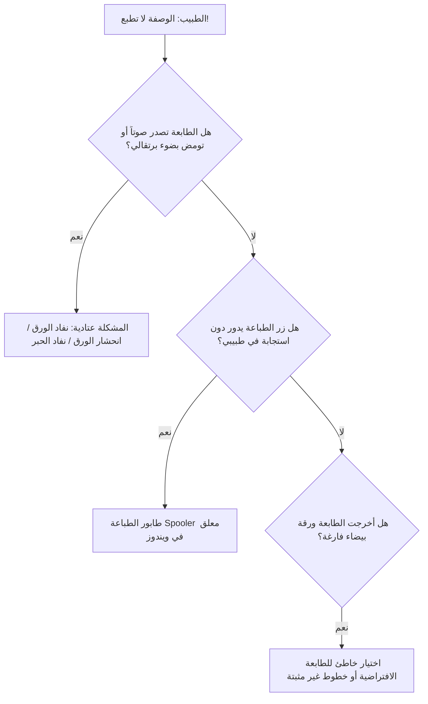

# سيناريو الطوارئ السريع : وصفة طبية عالقة أو تعذر طباعتها

> 🚨 **بروتوكول التدخل السريع عبر الهاتف (Niveau 1 Réflexe)**
> هذا السيناريو مخصص لحالات الضغط الشديد حيث يكون المريض جالساً أمام الطبيب في العيادة وينتظر تسلم وصفته.

---

## 1. ما يقوله مسؤول الدعم فوراً لتهدئة الطبيب في أول 10 ثوانٍ
> 📞 *"معك مهندس الدعم من ستيلارسوفت دكتور، لا تقلق أبداً وصفتك محفوظة بأمان ولن يضيع حرف منها. سنحل المشكلة خلال 30 ثانية لتسليم المريض وصفته فوراً."*

---

## 2. شجرة التشخيص الفوري خطوة بخطوة (30 ثانية)

---

## 3. خطة الإنقاذ السريع (Bypass de Secours)
إذا كانت الطابعة الرئيسية معطلة أو تستغرق وقتاً:
1. **الحل البديل الفوري رقم 1:** اطلب من الطبيب الضغط على سهم خيارات الطباعة واختيار **«تصدير PDF سريع»**.
2. تفتح الوصفة فوراً كملف PDF على الشاشة.
3. يمكن للطبيب طباعتها فورياً على أي طابعة ثانية متصلة بالعيادة أو إرسالها إلى طابعة الاستقبال لتطبعها السكرتيرة وتسلمها للمريض!

---

## 4. الإجراءات العلاجية التقنية الدقيقة

### أ. فحص طابور طباعة ويندوز (Windows Print Spooler)
1. في شريط مهام ويندوز بجانب الساعة، التحقق من وجود أيقونة طابعة صغيرة عليها علامة تعجب صفراء.
2. النقر المزدوج عليها وإلغاء أي مستند معلق أو محبوس بالضغط على `Printer > Cancel All Documents`.

### ب. إعادة تشغيل الطابعة
1. إطفاء الطابعة من زر الطاقة وتشغيلها بعد 5 ثوانٍ لتفريغ ذاكرتها العشوائية.
2. التحقق من كابل USB أو اتصال الشبكة الخاص بالطابعة.

---

## 5. مصفوفة التشخيص والأخطاء
| ما يراه الطبيب | السبب المباشر | التصرف الفوري المطلوب |
| :--- | :--- | :--- |
| مؤشر التحميل يدور دون توقف | عملية PDF معلقة في الخلفية | الضغط على مفتاح `Esc` ثم إعادة المحاولة أو تصدير PDF |
| ورقة بيضاء تماماً | نفاد الحبر بالكامل أو رأس طابعة جاف | إجراء تنظيف ذاتي للطابعة أو استبدال خرطوشة الحبر |
| رسالة "طابعة غير معينة" | تم تغيير اسم الطابعة أو حذف تعريفها | الذهاب إلى إعدادات طبيبي واختيار الطابعة الافتراضية |

---

## 6. متى يتم تصعيد المشكلة للمستوى 2 فوراً
- إذا تكرر توقف خدمة `Print Spooler` في ويندوز أكثر من مرتين في نفس الصباح.
- إذا كانت هناك حاجة لتثبيت تعريف طابعة جديد وتحديث النظام عن بعد عبر أداة المساعدة البعيدة.
