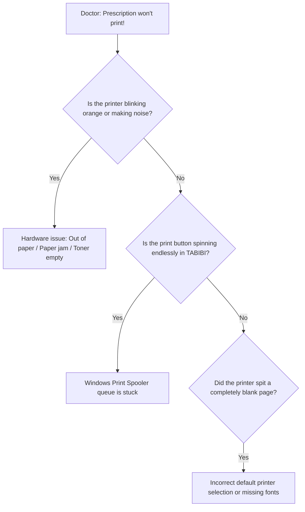

# Emergency Reflex Scenario: Prescription Locked or Printing Fails

> 🚨 **Level 1 Telephonic Emergency Protocol (Reflex Checklist)**
> This scenario is engineered for high-pressure situations where the patient is waiting in the doctor's office for their urgent prescription.

---

## 1. What Support Must Say in the First 10 Seconds to De-escalate
> 📞 *"Doctor, this is Stellarsoft support. Don't worry at all—your prescription is securely saved in the database, not a single word is lost. We will resolve this within 30 seconds so your patient leaves with their prescription."*

---

## 2. Immediate Step-by-Step Diagnostic Tree (30 Seconds)

---

## 3. Emergency Bypass Workaround
If the primary desk printer is unresponsive:
1. **Instant Workaround:** Instruct the doctor to click the print options arrow and select **"Quick PDF Export"**.
2. The prescription opens immediately on screen as a rendered PDF.
3. The doctor can print it immediately to any secondary connected printer, or push it to the reception desk for the secretary to hand over to the patient!

---

## 4. Precise Technical Remedies

### A. Clearing the Windows Print Spooler Queue
1. In the Windows system tray by the clock, look for a small printer icon with a warning badge.
2. Double-click it and clear jammed jobs by clicking `Printer > Cancel All Documents`.

### B. Hardware Power Cycle
1. Power off the printer using the physical switch, wait 5 seconds, and power back on to clear printer RAM.
2. Verify USB cable or LAN Ethernet connectivity.

---

## 5. Diagnostic & Troubleshooting Matrix
| What the Doctor Observes | Direct Cause | Immediate Action |
| :--- | :--- | :--- |
| Infinite loading spinner | Background PDF process timed out | Hit `Esc` key, then retry or select Export PDF |
| Completely blank page ejected | Toner totally exhausted or dry print head | Execute printer self-test or replace toner cartridge |
| Alert "No default printer set" | Printer renamed or driver uninstalled | Open TABIBI Settings > Printers > Assign default printer |

---

## 6. Escalation to Level 2
- Escalate immediately if the Windows `Print Spooler` service crashes repeatedly.
- Escalate if remote desktop driver re-installation is required.
