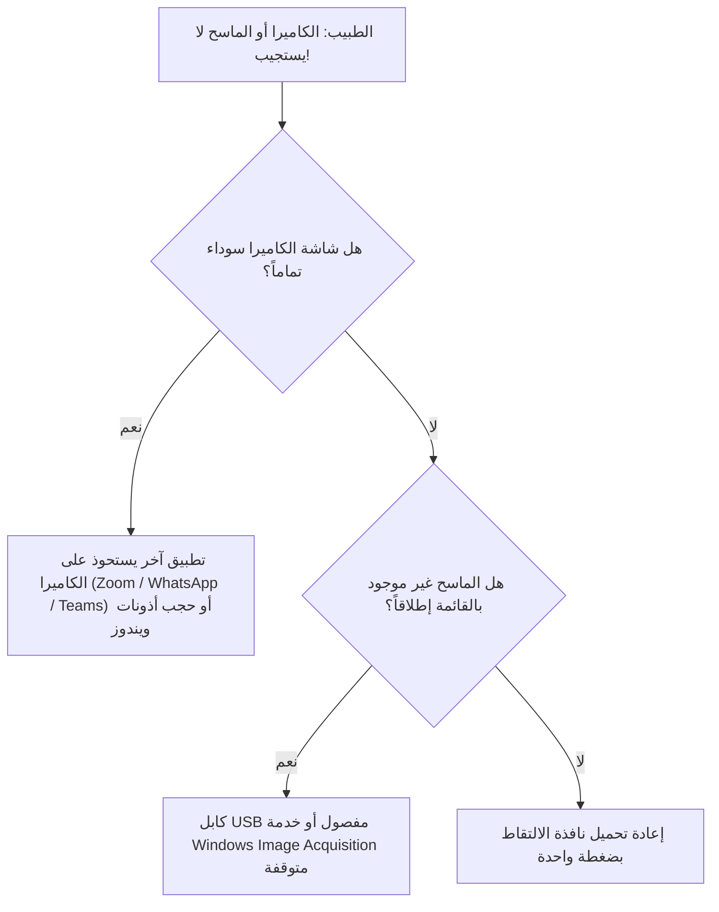

# سيناريو الطوارئ السريع : كاميرا الويب أو الماسح الضوئي غير متعرف عليه

> 🚨 **بروتوكول التدخل السريع عبر الهاتف (Niveau 1 Réflexe)**
> هذا السيناريو مخصص لحالات تعطل التقاط الصور أو مسح الوثائق أثناء وجود المريض داخل عيادة الفحص.

---

## 1. ما يقوله مسؤول الدعم فوراً للتهدئة
> 📞 *"مرحباً دكتور، معك الدعم الفني. سنفحص معاً اتصال الكاميرا والماسح، وسنقوم بتشغيلها خلال 30 ثانية دون الحاجة لإعادة تشغيل الحاسوب بالكامل."*

---

## 2. شجرة التشخيص الفوري خطوة بخطوة (30 ثانية)

---

## 3. الحلول الفورية الثلاثة

### أ. إغلاق البرامج المنافسة التي تستحوذ على الكاميرا (Camera Lock)
1. السبب الأكثر شيوعاً: تطبيق دردشة (WhatsApp Desktop، Skype، Zoom) مفتوح في الخلفية ويستحوذ على دفق الفيديو الحصري.
2. اطلب من الطبيب إغلاق كافة برامج المحادثة المفتوحة في شريط المهام بالأسفل.
3. إغلاق نافذة التصوير في طبيبي وفتحها مجدداً: ستعمل الكاميرا فوراً!

### ب. التحقق من صلاحيات الكاميرا في ويندوز (Windows Privacy)
1. فتح إعدادات ويندوز > **الخصوصية والأمان (Privacy & Security)** > **الكاميرا (Camera)**.
2. التأكد من أن خيار **«السماح لتطبيقات سطح المكتب بالوصول إلى الكاميرا»** مفعل باللون الأزرق.

### ج. فحص كابل USB وإعادة التوصيل
1. فصل كابل USB الخاص بالكاميرا أو الماسح وإعادة تركيبه في منفذ USB مختلف (يُفضل استخدام منفذ خلفي في الحاسوب المكتبي).
2. سماع نغمة ويندوز المميزة لتوصيل جهاز جديد.

---

## 4. مصفوفة التشخيص السريع
| ما يظهر للطبيب | السبب المباشر | الحل الفوري |
| :--- | :--- | :--- |
| شاشة سوداء مع علامة تحميل | الكاميرا محجوزة بواسطة برنامج ثانٍ | إغلاق البرامج الأخرى وإعادة فتح نافذة التصوير |
| الماسح لا يظهر في القائمة | كابل USB غير موصل أو الماسح مطفأ | تشغيل زر طاقة الماسح والتأكد من توصيل الكابل |
| الصورة تظهر مقلوبة أو باهتة | الإضاءة منخفضة أو زاوية الكاميرا مائلة | استخدام أزرار التدوير وتعديل زاوية الكاميرا |

---

## 5. متى يتم تصعيد المشكلة للمستوى 2
- إذا كان الماسح قديماً ويحتاج إلى تثبيت حزمة تعريفات TWAIN 32-bit خاصة.
- تلف فيزيائي في كابل USB أو تعطل لوحة التحكم الخاصة بالماسح.
