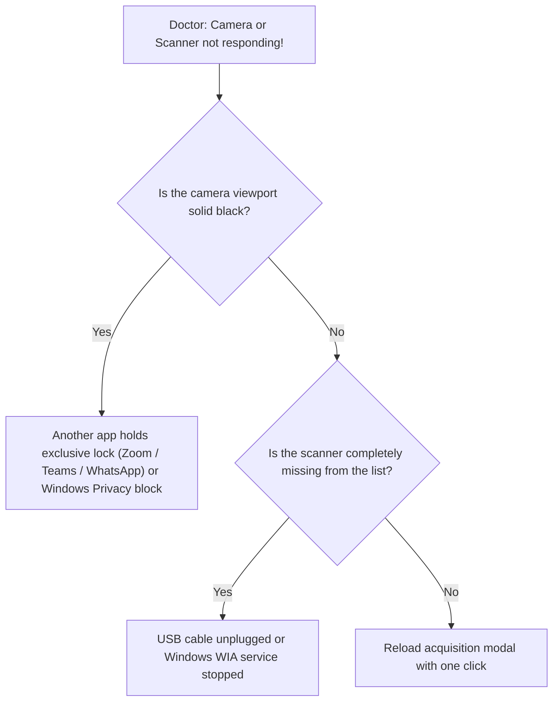

# Emergency Reflex Scenario: Webcam or Document Scanner Not Detected

> 🚨 **Level 1 Telephonic Emergency Protocol (Reflex Checklist)**
> Tailored for clinical situations where capturing a patient photograph or scanning a report fails during an ongoing encounter.

---

## 1. What Support Must Say in the First 10 Seconds to De-escalate
> 📞 *"Hello Doctor, Stellarsoft support here. We will verify your camera and scanner connections together and restore your video feed within 30 seconds without needing to reboot your computer."*

---

## 2. Immediate Step-by-Step Diagnostic Tree (30 Seconds)

---

## 3. Three Immediate Corrective Actions

### A. Closing Conflicting Camera Applications (Exclusive Lock)
1. Most common cause: A background messaging app (WhatsApp Desktop, Zoom, Teams, Skype) holds an exclusive video lock.
2. Instruct doctor to close background communication apps in the Windows taskbar.
3. Close the TABIBI capture drawer and reopen it: The live feed restores immediately!

### B. Checking Windows Privacy Permissions
1. Windows Settings > **Privacy & Security** > **Camera**.
2. Verify that **"Let desktop apps access your camera"** is toggled ON (Blue).

### C. Checking USB Ports & Reconnecting
1. Unplug the USB cable of the webcam/scanner and reseat it into an alternate USB port (prefer rear motherboard ports on desktop towers).
2. Listen for the Windows device connection chime.

---

## 4. Rapid Diagnostic & Troubleshooting Matrix
| What the Doctor Sees | Direct Cause | Immediate Remedy |
| :--- | :--- | :--- |
| Solid black screen with spinner | Camera stream locked by secondary process | Terminate conflicting apps and reopen capture modal |
| Scanner missing from device list | Power turned off or USB disconnected | Power on scanner switch and reseat USB cable |
| Image inverted or dim | Low ambient lighting or camera tilt | Use rotation controls and adjust desk illumination |

---

## 5. Escalation to Level 2
- Escalate if dealing with legacy hardware requiring custom 32-bit TWAIN bridge wrappers.
- Escalate if physical cable hardware fault is identified.
